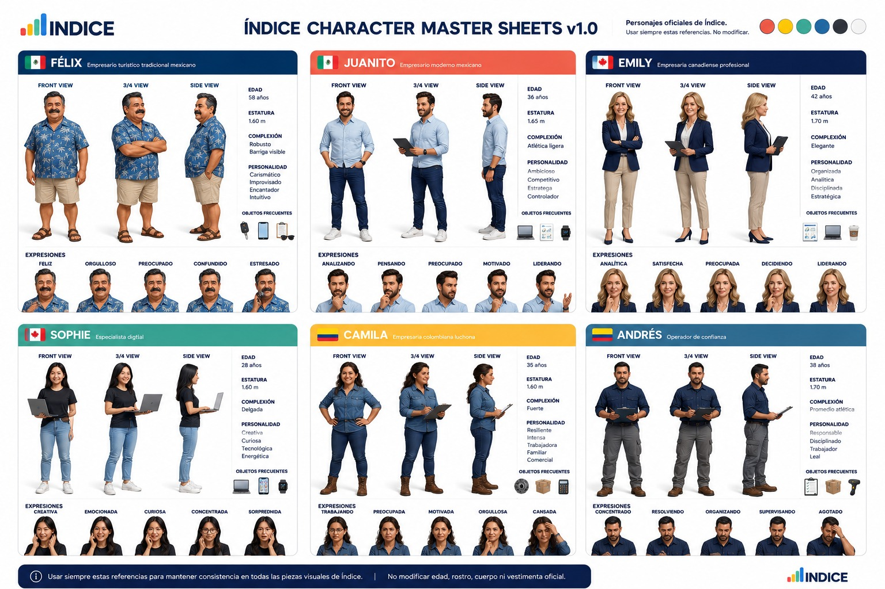

# Índice Modo aprendiz — Frontend Engine v2

## Estándar especializado del Frontend Operating System

**Estado:** especificación canónica y replicable

**Rama de modelado:** `feature/frontend-engine-v2-learning-mode`

**Referencia funcional:** Recursos Humanos, pestaña Colaboradores

**Referencia global:** Dashboard principal

**Nombre visible oficial:** `Modo aprendiz`

**Patrón inicial:** 17 de julio de 2026.

**Estándar modular vigente:** decisión del 5–6 de septiembre de 2026 (sección 29).

Este documento define cómo incorporar Modo aprendiz a cualquier módulo o pestaña de Índice sin rediseñar la interfaz, alterar sus funciones ni inventar un patrón distinto en cada implementación.

Extiende [Índice Frontend Operating System v2.0](./indice-frontend-operating-system-v2.md). Para una implementación se deben consultar ambos documentos. El sistema general conserva autoridad sobre navegación, módulos, pestañas, filtros, tablas, modales, permisos, estados, modo oscuro y accesibilidad. Este documento tiene autoridad sobre el comportamiento y contenido específico de Modo aprendiz.

La implementación de Recursos Humanos es la referencia visual y funcional. Si una interpretación futura produce un resultado diferente al patrón aprobado de RH, debe detenerse y documentarse antes de cambiarlo.

El repositorio contiene otras apariciones de `learningModeActive` y guías creadas antes de cerrar este modelo. Esas implementaciones pueden servir para conocer su módulo, pero **no son referencia visual ni estructural** hasta que sean migradas y validadas contra este estándar. Ante una diferencia, prevalecen este documento y la pestaña Colaboradores de RH.

---

## Vigencia y ruta de lectura

Comienza por el [estándar modular aprobado](#estandar-modular-vigente). Después consulta propósito,
contenido y controles de las secciones 1–9, y la verificación de 24–25.

| Tema | Regla vigente |
|---|---|
| Geometría de módulos | Acompañante compacto y expansión bajo demanda, según 29.2 y 29.5. |
| Título y acciones | Permanecen visibles y en su ubicación original, según 9.2–9.3 y 29.5. |
| Progreso | Privado por usuario y empresa; visitar no significa aplicar, según 29.3–29.4. |
| Dashboard | Conserva sus seis secciones; no adopta automáticamente la geometría de módulo. |
| Dos tarjetas y carrusel | Patrón anterior, conservado como referencia de contenido y migración. No se exige en nuevas réplicas. |

Las descripciones de adopción de 20–23 corresponden a sus etapas originales. No certifican el
estado de todos los módulos. Las secciones de geometría histórica están señaladas; sus ejemplos
no sustituyen la sección 29 ni las reglas generales de permisos y accesibilidad.

## 1. Propósito

Modo aprendiz ayuda al propietario o responsable de una empresa a comprender:

1. qué herramientas existen en la pestaña actual;
2. qué hace cada control realmente;
3. cuándo conviene usarlo;
4. qué problema operativo ayuda a resolver;
5. cómo una empresa comparable lo aplica dentro de la Metodología Índice.

No es un recorrido infantil, un tutorial genérico ni una visita de marketing. Es una capa de enseñanza empresarial integrada en la interfaz existente.

El resultado esperado es **Claridad Operacional**: conectar estructura, personas, procesos, dinero, productos e información para construir una operación clara, inteligente y escalable.

### 1.1 Qué no hace

Modo aprendiz no debe:

- cambiar contratos del backend, API, rutas o payloads;
- modificar permisos ni mostrar acciones que el usuario no puede ejecutar;
- sustituir la operación real por una demostración;
- crear botones decorativos que imiten acciones existentes;
- cambiar estilos, colores, tamaños, iconos, nombres o callbacks de botones reales;
- bloquear la navegación con tours de pantalla completa;
- colocar globos flotantes encima de tablas o formularios;
- forzar fotografías dentro de las tarjetas de un módulo;
- introducir una segunda identidad visual;
- explicar la interfaz como si el usuario fuera un niño o no supiera dirigir un negocio.

---

## 2. Cómo usar este estándar

Antes de implementar Modo aprendiz en un módulo nuevo:

1. Leer primero la sección 29 y esta ruta de vigencia; usar el resto según el área afectada.
2. Leer el Frontend Operating System v2.
3. Estudiar la pestaña Colaboradores de Recursos Humanos con Modo aprendiz encendido y apagado.
4. Auditar el código y la interfaz real del módulo objetivo.
5. Inventariar todos sus controles operativos, incluidos los condicionales y los sujetos a permisos.
6. Identificar la barra de título de cada pestaña y sus nodos de acción originales.
7. Identificar las barras resumen/KPI que pueden compactarse sin ocultar información indispensable.
8. Escribir primero el contenido neutral de cada función.
9. Escribir después una aplicación diferente para Emily, Juanito y Camila.
10. Implementar el acompañante compacto, expansión y progreso privado definidos en la sección 29.
11. Validar ambos estados: encendido y apagado.
12. Validar permisos, escritorio, tableta, móvil, modo oscuro, teclado, TypeScript y build.

No se debe copiar el texto de RH a otro módulo. Se copia la estructura; las funciones y los problemas empresariales se investigan de nuevo.

---

## 3. Dos capas del producto

Modo aprendiz tiene dos capas relacionadas, pero no intercambiables.

### 3.1 Dashboard: recorrido único de la metodología

El Dashboard explica el orden completo de la Metodología Índice y permite seleccionar el caso empresarial. Es la única pantalla que muestra las seis etapas juntas.

### 3.2 Módulo: guía de la pestaña activa

Cada módulo explica únicamente las funciones de la pestaña activa y cómo las usa el personaje seleccionado. No repite el recorrido de seis etapas ni vuelve a pedir la selección del personaje.

```txt
Dashboard
  ├─ explica la metodología completa
  ├─ muestra progreso por etapas
  └─ selecciona o cambia el caso empresarial

Módulo > pestaña activa
  ├─ enseña cada control real de esa pestaña
  └─ aplica el mismo control al caso seleccionado
```

---

## 4. Contrato de estado global

`App.tsx` es propietario del estado global de Modo aprendiz.

| Propósito | Clave local | Tipo | Comportamiento |
| --- | --- | --- | --- |
| Preferencias del modo | `indice.app.learningMode.user-{userId}.company-{companyId}` | `{ version, active, visible, step }` | Conserva de forma conjunta el estado global, la visibilidad del recorrido y la etapa actual para el usuario y empresa autenticados. |
| Caso seleccionado | `indice.learningMode.character` | `emily \| juanito \| camila` | Se comparte entre Dashboard y módulos y no se borra al apagar o reiniciar el recorrido. |

Cada módulo compatible recibe:

```tsx
interface ModuleProps {
  learningModeActive?: boolean;
  onNavigate: (page?: PageId) => void;
}
```

```tsx
<Module
  learningModeActive={learningModeActive}
  onNavigate={handleModuleNavigation}
/>
```

Reglas:

- la ausencia de una guía nunca bloquea un módulo;
- apagar el modo restaura la interfaz normal, no recarga datos y no borra el personaje;
- ocultar el recorrido en el Dashboard no equivale a apagar Modo aprendiz;
- el personaje se elige o cambia en el Dashboard;
- una guía de módulo muestra solamente el personaje seleccionado;
- si no hay personaje válido, la tarjeta derecha invita a elegir un caso en el Panel Inicial;
- el índice del carrusel de la pestaña es estado de interfaz local; no se debe inventar persistencia sin una decisión de producto.

### 4.1 Modal global de configuración

El birrete del encabezado abre un modal `standard-form` del sistema compartido con identidad azul de Índice. La interacción usa un borrador local: cerrar, cancelar o presionar Escape descarta los cambios; `Guardar cambios` actualiza en una sola operación las preferencias de la sesión.

El modal permite:

- encender o apagar el acompañamiento global;
- mostrar u ocultar el recorrido de seis etapas en el Panel Inicial cuando el modo está activo;
- consultar la etapa actual y reiniciarla a la primera;
- comprender el efecto de la combinación elegida antes de guardarla.

No permite cambiar permisos, simular operaciones ni borrar el caso empresarial. Apagar el modo conserva `visible`, `step` y el caso seleccionado para que el usuario pueda retomar su recorrido después.

Archivos globales actuales:

- `react/src/app/App.tsx`
- `react/src/app/components/Header.tsx`
- `react/src/app/hooks/useLocalStorageState.ts`
- `react/src/app/hooks/useLearningModePreferences.ts`
- `react/src/app/learningMode/components/LearningModeSettingsModal.tsx`
- `react/src/app/learningMode/preferences.ts`
- `react/src/app/learningMode/characters.ts`

---

## 5. Audiencia, voz y promesa

### 5.1 Para quién se escribe

El lector es un empresario, propietario, director o responsable operativo que busca mejorar y hacer crecer su negocio. Puede conocer profundamente su actividad y, al mismo tiempo, no tener formalizados todos sus procesos.

Se le habla como a una persona capaz que necesita visibilidad y método, no como a un principiante incapaz.

### 5.2 Cómo debe sonar

La voz es:

- profesional;
- clara;
- segura;
- cercana;
- humana;
- práctica;
- específica al negocio;
- orientada a decisiones y resultados.

Cada explicación debe conectar la función con al menos uno de estos resultados:

- claridad operativa;
- responsabilidades visibles;
- equipos organizados;
- procesos repetibles;
- control y trazabilidad;
- menos errores y retrabajo;
- menor dependencia del propietario;
- mejores decisiones;
- crecimiento estructurado;
- escalabilidad.

### 5.3 Cómo no debe sonar

Evitar:

- lenguaje infantil: “vamos a jugar”, “es muy fácil”, “no te preocupes”;
- tono académico: “objetivo pedagógico”, “unidad didáctica”;
- tono técnico vacío: “gestiona los datos de esta pantalla”;
- órdenes sin contexto: “haz clic aquí”;
- marketing genérico: “lleva tu empresa al siguiente nivel”;
- burocracia: “configuración requerida”, “ruta operativa”;
- afirmaciones absolutas no demostrables;
- párrafos que solo repiten el nombre del botón.

No usar `Ruta operativa` como nombre visible. En español, el producto siempre se llama **Modo aprendiz**.

### 5.4 Fórmula de redacción neutral

Para cada función, responder en este orden:

```txt
Nombre real
  -> para qué sirve en el negocio
  -> qué sucede en el sistema al usarla
  -> cuándo conviene usarla
  -> consejo adaptado al caso seleccionado
```

Ejemplo aceptado:

> **Agregar colaborador**
>
> Crea el expediente laboral de una persona y la incorpora formalmente a la operación. Abre un formulario para registrar datos personales, puesto, unidad, negocio, documentos y horario inicial. Úsalo desde el ingreso del colaborador, antes de asignarle responsabilidades o accesos.

Ejemplo rechazado:

> Usa este botón para agregar datos. Haz clic para continuar.

---

## 6. Dashboard: contrato de la Metodología Índice

Cuando `learningModeActive && learningModeVisible` sea verdadero, el Dashboard muestra primero el recorrido y sustituye temporalmente el énfasis normal de KPIs y favoritos. La navegación a los módulos continúa disponible.

### 6.1 Texto canónico en español

```txt
Modo aprendiz · Metodología Índice
Haz tu operación más clara, inteligente y escalable
Avanza por seis etapas para conectar la estructura, las personas, los procesos,
el dinero, los productos y la información de tu empresa.
```

Etiqueta de avance: `Progreso`.

Estados visibles:

- `Revisada`
- `Etapa actual`
- `Siguiente`
- `Bloqueado`, solamente cuando exista un bloqueo real.

### 6.2 Orden canónico de las seis etapas

| # | Etapa | Explicación | Módulos | Color |
| --- | --- | --- | --- | --- |
| 01 | Define la estructura de tu empresa | Establece la información, áreas y sedes que darán contexto a toda la operación. | Panel Inicial | Azul `#2563EB` |
| 02 | Organiza a tu equipo | Asigna puestos, responsabilidades, horarios y reglas para que cada persona conozca su función. | Recursos Humanos | Aqua `#59C3A5` |
| 03 | Transforma el trabajo en procesos | Estandariza tareas, responsables y seguimiento para operar con menos errores y dependencia. | Procesos y tareas | Amarillo `#F4C84A` |
| 04 | Da claridad al dinero | Centraliza gastos, caja y cartera para comprender cómo se mueven los recursos de la empresa. | Gastos, Caja chica, Cartera | Verde `#147514` |
| 05 | Conecta productos y ventas | Relaciona catálogo, inventario, clientes y ventas para proteger márgenes y atender mejor. | Punto de venta, Ventas, Inventarios | Coral `#FF6B5E` |
| 06 | Dirige con inteligencia operacional | Convierte los datos de toda la empresa en indicadores para decidir con claridad y crecer con control. | KPIs | Morado, familia `purple-600` |

No cambiar el orden para que coincida con el orden accidental de un menú. Este orden explica la metodología empresarial.

### 6.3 Uso del color en las tarjetas de etapa

El color de la etapa se aplica a:

- borde de la tarjeta;
- franja superior;
- contenedor del icono;
- número de etapa;
- estado activo;
- segmento de progreso;
- accesos a módulos.

El color crea asociación con los módulos; no es decoración. No debe ser el único indicador de estado: conservar número, texto, icono y etiqueta.

### 6.4 Geometría actual del recorrido

| Elemento | Contrato de código |
| --- | --- |
| Contenedor del Dashboard | `max-w-[1600px]`, `px-4 sm:px-6 lg:px-8` |
| Tarjeta exterior | `rounded-xl`, borde 1 px, superficie blanca/neutra |
| Padding exterior | `p-5 lg:p-6` = 20/24 px |
| Rejilla | `md:grid-cols-2 xl:grid-cols-6`, `gap-3` = 12 px |
| Tarjeta de etapa | `min-h-[228px]`, `rounded-xl`, `border-2`, `px-4 pb-4 pt-5` |
| Franja superior | altura 4 px (`h-1`) |
| Contenedor de icono | 44 × 44 px (`h-11 w-11`) |
| Número | 24 px visual (`text-2xl`), peso 900 (`font-black`) |
| Título de etapa | 15 px, semibold |
| Descripción | 12 px, interlineado 20 px, máximo cuatro líneas |

Las clases son la fuente de verdad. Los píxeles ayudan a revisar; no deben reemplazar tokens existentes con CSS aislado.

Archivos de referencia:

- `react/src/app/Dashboard/MainDashboard.tsx`
- `react/src/app/Dashboard/components/OperationalJourney.tsx`
- `react/src/app/Dashboard/operationalJourney.ts`
- `react/src/app/Dashboard/translations/`

---

## 7. Casos empresariales y selección

El selector se presenta como **Casos empresariales**, no como un selector de avatares o juego.

Texto canónico:

```txt
Casos empresariales
Elige el negocio que acompañará tu recorrido
Conoce cómo otros empresarios aplican la Metodología Índice para transformar
operaciones complejas en empresas claras y escalables.
```

Acciones:

- antes de elegir: `Acompañar este caso`;
- después de elegir: `Cambiar caso`;
- etiqueta del seleccionado: `Caso empresarial seleccionado`.

### 7.1 Ubicación y comportamiento

- aparece en el Dashboard cuando el recorrido está visible;
- se coloca después del recorrido y de los módulos operativos guiados;
- muestra los tres casos antes de la selección;
- después de elegir, muestra solamente el caso activo y una acción discreta para cambiarlo;
- el cambio actualiza todas las guías de módulo mediante la misma clave local;
- los módulos no muestran botones `Emily / Juanito / Camila` ni otra forma de cambiar el caso.

### 7.2 Imágenes del Dashboard

Activos actuales:

- `/images/learning-mode/emily-dashboard.png`
- `/images/learning-mode/juanito-dashboard.png`
- `/images/learning-mode/camila-dashboard.png`

Especificación:

| Propiedad | Valor |
| --- | --- |
| Archivo fuente recomendado | PNG o WebP optimizado |
| Proporción | 2:3 vertical |
| Medida fuente actual | 1024 × 1536 px |
| Contenedor visible | 128 × 192 px (`w-32 h-48`) |
| Ajuste | `object-contain object-bottom` |
| Recorte forzado | Prohibido |
| Deformación | Prohibida |
| Texto integrado en imagen | Prohibido |

La fotografía o ilustración debe respirar dentro del contenedor. Si una imagen no encaja, se corrige el activo o se usa `object-contain`; no se estira al personaje ni se cambia la tarjeta para “llenar” el espacio.

La hoja maestra visual permanece como documentación y no se presenta completa en el producto:



En los módulos, la imagen del personaje es opcional y actualmente **no forma parte del patrón canónico**. La tarjeta derecha usa un emoji empresarial a color para mantenerla compacta. No forzar una fotografía.

Archivo compartido de definiciones:

- `react/src/app/learningMode/characters.ts`

---

## 8. Personajes: canon de contenido

Estos tres casos son suficientes para Frontend Engine v2. No agregar otro hasta que los tres tengan una historia coherente en todos los módulos modelados.

### 8.1 Emily — Cafeterías

| Rasgo | Canon |
| --- | --- |
| País y edad | Canadiense, 42 años |
| Negocio | Cadena creciente de cafeterías |
| Personalidad | Organizada, analítica, disciplinada, estratégica |
| Fortaleza | Estándares, calidad, planeación y experiencia del cliente |
| Punto ciego | Puede concentrar decisiones para proteger la calidad |
| Meta | Abrir 100 sucursales que funcionen igual de bien sin depender de ella |
| Temas narrativos | Consistencia, preparación, delegación, calidad y expansión ordenada |
| Emoji de módulo | `☕` |

Cómo escribirla:

- relacionar funciones con estándares repetibles entre sucursales;
- mostrar que prepara la operación antes de crecer;
- explicar cómo delega sin perder calidad;
- usar ejemplos de baristas, gerentes, turnos, recetas, servicio y ubicaciones.

No escribirla como una ejecutiva fría, una consultora externa o una persona sin problemas operativos.

### 8.2 Juanito — Supermercados

| Rasgo | Canon |
| --- | --- |
| País y edad | Mexicano, 36 años; Monterrey |
| Negocio | Cadena creciente de supermercados |
| Personalidad | Ambicioso, competitivo, estratégico, controlador |
| Fortaleza | Ventas, números, márgenes y lectura comercial |
| Punto ciego | Lo que no está en sus números puede quedar informal o depender de su memoria |
| Meta | Convertir sus supermercados en una cadena nacional consistente |
| Temas narrativos | Inventario, márgenes, datos no numéricos, responsabilidades y control multisucursal |
| Emoji de módulo | `🛒` |

Cómo escribirlo:

- partir de que sabe vender y entiende los números;
- contrastar esa fortaleza con personas, acuerdos o responsabilidades que también necesitan registro;
- mostrar cómo convierte su gusto por medir en controles útiles, sin caricaturizarlo;
- usar ejemplos de tiendas, cajas, almacén, inventarios, vendedores y responsables.

Tono narrativo aprobado:

> Juanito es muy bueno con los números, pero usa RH para asegurarse de que lo que no cabe en una hoja de cálculo también esté bajo control. Registra a cada colaborador con su expediente completo porque ya aprendió que, si no tiene los datos, después se le olvidan y no sabe dónde encontrarlos.

No escribirlo como alguien ignorante, desordenado por naturaleza o interesado solamente en dinero.

### 8.3 Camila — Refaccionarias

| Rasgo | Canon |
| --- | --- |
| País y edad | Colombiana, 35 años; Bogotá |
| Negocio | Refaccionaria/autopartes de operación cercana y familiar |
| Personalidad | Resiliente, intensa, trabajadora, familiar, comercial |
| Fortaleza | Resolver, relacionarse con clientes y sostener el negocio |
| Punto ciego | Acuerdos informales y dependencia de su esfuerzo personal |
| Meta | Convertir una operación familiar en una empresa organizada y segura |
| Temas narrativos | Roles claros, formalización, delegación, inventario, proveedores y continuidad |
| Emoji de módulo | `🔧` |

Cómo escribirla:

- mostrar cómo formaliza acuerdos sin perder cercanía;
- explicar la diferencia entre confianza y responsabilidad visible;
- ayudarla a dejar de resolver personalmente cada excepción;
- usar ejemplos de mostrador, almacén, familiares, vendedores, piezas y proveedores.

No retratar a su familia como incompetente ni presentar la formalización como desconfianza.

### 8.4 Diferencia obligatoria entre textos

Las tres historias no pueden ser el mismo párrafo con el nombre y el negocio reemplazados.

Para una misma función, deben variar:

| Dimensión | Emily | Juanito | Camila |
| --- | --- | --- | --- |
| Motivación | conservar estándares al expandirse | convertir datos y control en consistencia | ordenar sin perder cercanía familiar |
| Problema típico | diferencias entre sucursales | información fuera de sus números | acuerdos de palabra y dependencia personal |
| Acción | estandariza y prepara | registra, compara y verifica | formaliza, asigna y delega |
| Resultado | experiencia repetible | trazabilidad y control multisucursal | responsabilidades claras y continuidad |

Ejemplo de `Agregar colaborador`:

- **Emily:** registra desde el primer día sucursal, puesto y horario para preparar equipos equivalentes al abrir nuevas cafeterías.
- **Juanito:** concentra el expediente completo porque aprendió que los datos no numéricos también deben estar localizables y bajo control.
- **Camila:** registra también a familiares para convertir acuerdos de palabra en responsabilidades visibles sin perder cercanía.

---

## 9. Arquitectura visual de un módulo

### 9.1 Orden obligatorio

Con Modo aprendiz apagado:

```txt
Encabezado general del módulo
Navegación de pestañas
Contenido de la pestaña
  ├─ barra de título original + acciones originales
  ├─ filtros
  ├─ resumen/KPIs de la pestaña, si existe
  └─ operación real
```

Con Modo aprendiz encendido:

```txt
Encabezado general del módulo                 SE CONSERVA
Navegación de pestañas                        SE CONSERVA
Modo aprendiz, inmediatamente bajo pestañas   APARECE
  ├─ resumen: contexto real, avance y Aprender más
  ├─ cerrado: flujo lógico completo en una línea
  └─ expandido: riel fijo + objetivo + detalles bajo demanda
Contenido de la pestaña
  ├─ barra de título original                  SE CONSERVA
  ├─ acciones originales                       SE CONSERVAN EN SU LUGAR
  ├─ filtros                                   SE CONSERVAN
  ├─ resumen/KPIs local de la pestaña          PUEDE COMPACTARSE
  └─ operación real                            SE CONSERVA
```

La posición canónica es **inmediatamente debajo de las pestañas y antes del contenido operativo de la pestaña**.

No colocar la guía:

- antes del encabezado general;
- arriba de las pestañas;
- después de la tabla;
- dentro de un modal;
- como panel flotante;
- en una columna lateral que reduzca la operación.

### 9.2 Regla absoluta de la barra de título

La barra propia de cada pestaña normalmente contiene:

- emoji o icono;
- título de la vista;
- subtítulo;
- acciones como `Columnas`, `Agregar`, `Exportar` o equivalentes.

Al encender Modo Aprendiz esa superficie permanece visible, completa y en su posición original. La guía enseña; la barra de título identifica y permite operar. No son sustitutos.

El encabezado general del módulo, por ejemplo `Recursos Humanos`, no es duplicado y permanece visible.

### 9.3 Regla absoluta de las acciones originales

Modo Aprendiz no cambia la colocación, el diseño ni la función de los botones existentes. Las acciones permanecen dentro de la barra de título, conservando sus permisos, estados, tooltips, handlers y analítica.

El proveedor compartido puede seguir propagando el estado del modo para compactar elementos secundarios, pero el puente de compatibilidad siempre debe renderizar la barra original:

```tsx
<LearningModeHeaderActionsProvider active={learningModeActive}>
  <Module />
</LearningModeHeaderActionsProvider>
```

```tsx
export function ModuleTitleBar({ actions, ...props }: Props) {
  return (
    <LearningModeTitleBarBridge actions={actions}>
      <OriginalTitleBar actions={actions} {...props} />
    </LearningModeTitleBarBridge>
  );
}
```

Está prohibido:

- crear copias visuales de los botones;
- escribir nuevos callbacks para simularlos;
- cambiar su `variant`, clase, alto, padding, radio o color;
- sustituir su emoji o icono;
- renombrarlos;
- hacer visibles acciones que un permiso oculta;
- trasladarlos a la guía;
- ocultar su barra porque la guía está activa;
- mover acciones propias de una fila, filtro o modal al encabezado.

Archivos canónicos compartidos:

- `react/src/app/learningMode/components/LearningModeHeaderActions.tsx`
- `react/src/app/learningMode/components/ModuleLearningGuide.tsx`
- `react/src/app/BasicModules/HumanResources/shared/HrTitleBar.tsx`

### 9.4 Regla de la barra KPI

Mientras Modo Aprendiz está activo, una barra resumen/KPI local puede ocultarse o compactarse para recuperar espacio vertical cuando no sea indispensable para completar la tarea. Cuando se apaga, reaparece sin perder estado.

Esto **no** autoriza a:

- eliminar datos o peticiones del módulo;
- ocultar la pestaña funcional de KPIs/Indicadores;
- esconder indicadores indispensables dentro de un flujo transaccional;
- cambiar la selección de KPIs;
- borrar el componente.

La implementación debe ser condicional y reversible:

```tsx
{!learningModeActive ? <TabKpiStrip {...props} /> : null}
```

---

## 10. Encabezado del bloque Modo aprendiz

> Referencia del patrón inicial: las reglas de contenido, accesibilidad y localización siguen
> aplicando; la geometría de dos tarjetas, el carrusel y los componentes descritos se contrastan
> con el [estándar modular vigente](#estandar-modular-vigente). No se copian como nueva estructura.

El bloque exterior ocupa todo el ancho disponible de la zona del módulo.

### 10.1 Composición

```txt
┌─────────────────────────────────────────────────────────────────────┐
│ [espacio de balance]     💡 MODO APRENDIZ          [acciones reales] │
│                          Guía de ... · Pestaña                       │
├─────────────────────────────────────────────────────────────────────┤
│ tarjeta de funciones       │ tarjeta del caso seleccionado           │
└─────────────────────────────────────────────────────────────────────┘
```

En escritorio, el centro no debe desplazarse visualmente por el ancho de las acciones. Usar una rejilla de tres columnas equivalentes en los extremos:

```txt
sm:grid-cols-[minmax(0,1fr)_auto_minmax(0,1fr)]
```

En móvil, el encabezado se apila y las acciones conservan su comportamiento responsivo original.

### 10.2 Texto

- Eyebrow: `💡 MODO APRENDIZ`.
- Título: específico del dominio; en RH, `Guía de operación del equipo`.
- Contexto: nombre corto de la pestaña activa; en RH, `Colaboradores`.

El título no debe describir un componente de software. Debe nombrar la capacidad empresarial que se está aprendiendo.

Correcto: `Guía de operación del equipo`.

Incorrecto: `Carrusel de funciones de Recursos Humanos`.

### 10.3 Medidas actuales

| Elemento | Clase canónica | Referencia |
| --- | --- | --- |
| Exterior | `overflow-hidden rounded-xl border` | ancho completo, borde 1 px |
| Fondo claro | `bg-white/95` | superficie discreta |
| Sombra | `shadow-[0_12px_32px_-28px_rgba(...)]` | muy ligera |
| Encabezado | `grid items-center gap-3 px-4 py-3` | 16 px horizontal, 12 px vertical |
| Separador | `border-b` | 1 px |
| Eyebrow | `text-[10px] font-semibold uppercase tracking-[0.16em]` | 10 px |
| Emoji del modo | `text-base` | 16 px |
| Título | `text-base font-semibold` | 16 px |
| Contexto de pestaña | `text-xs` | 12 px |

El color del encabezado y de la tarjeta izquierda hereda la identidad del módulo. En RH usa aqua `#59C3A5` y texto profundo `#0F766E`.

---

## 11. Dos tarjetas sincronizadas

> Referencia del patrón inicial: las reglas de contenido, accesibilidad y localización siguen
> aplicando; la geometría de dos tarjetas, el carrusel y los componentes descritos se contrastan
> con el [estándar modular vigente](#estandar-modular-vigente). No se copian como nueva estructura.

El cuerpo utiliza dos tarjetas simétricas:

- izquierda: función real de la pestaña;
- derecha: aplicación de esa misma función por el personaje seleccionado.

Las dos comparten:

- el mismo índice;
- el mismo número total de funciones;
- los mismos botones anterior/siguiente;
- los mismos puntos de posición;
- la misma altura mínima;
- cambio circular del último al primero y del primero al último.

Mover cualquier control actualiza ambas tarjetas a la misma función. No existen dos carruseles independientes.

### 11.1 Geometría canónica

| Elemento | Clase canónica | Medida de referencia |
| --- | --- | --- |
| Rejilla | `grid items-stretch gap-3 p-3 lg:grid-cols-2 lg:p-4` | una columna móvil; dos iguales desde `lg`; gap 12 px |
| Tarjetas | `flex h-full min-h-[360px] flex-col rounded-xl p-4 text-center` | mínimo 360 px; padding 16 px |
| Ancho | determinado por la rejilla | 50/50 en escritorio |
| Bloques internos | `max-w-2xl` | no extender texto a todo el ancho |
| Paneles auxiliares | `rounded-lg px-3 py-2.5` | 12 px horizontal, 10 px vertical |
| Separador inferior | `border-t pt-3` | 12 px superior |
| Flechas | `h-8 w-8 rounded-full` | 32 × 32 px |
| Área de puntos | `max-w-[176px]` | máximo 176 px |
| Punto inactivo | `h-1.5 w-1.5` | 6 × 6 px |
| Punto activo | `h-1.5 w-6` | 6 × 24 px |
| Contador | `min-w-[38px] text-[10px]` | ancho mínimo 38 px |

`min-h-[360px]` no es una altura fija. El contenido puede crecer. No usar recortes, alturas rígidas ni `overflow-hidden` para esconder texto narrativo.

### 11.2 Simetría

Las tarjetas deben:

- comenzar y terminar alineadas;
- usar el mismo padding y radio;
- centrar icono, microetiqueta, título y explicación;
- mantener los controles de carrusel al fondo con `mt-auto`;
- permitir que el texto central crezca sin desalinear el pie;
- apilarse con el mismo ancho en móvil.

Simetría no significa que ambas tengan exactamente los mismos subpaneles. Significa equilibrio de contenedor, jerarquía, alineación y navegación.

---

## 12. Tarjeta izquierda: funciones y consejos

> Referencia del patrón inicial: las reglas de contenido, accesibilidad y localización siguen
> aplicando; la geometría de dos tarjetas, el carrusel y los componentes descritos se contrastan
> con el [estándar modular vigente](#estandar-modular-vigente). No se copian como nueva estructura.

La tarjeta izquierda explica el producto sin perder el contexto empresarial.

### 12.1 Jerarquía obligatoria

1. Emoji a color de la función.
2. `APRENDE ESTA FUNCIÓN · {tipo de control}`.
3. Nombre exacto del control.
4. Propósito empresarial.
5. `QUÉ SUCEDE AL USARLA`.
6. `CUÁNDO USARLA`.
7. `CONSEJO PARA {PERSONAJE}` o `CONSEJO PRÁCTICO`.
8. Navegación sincronizada.
9. CTA discreto hacia el contenido real, cuando aporta valor.

### 12.2 Tipografía

| Contenido | Clase | Regla de redacción |
| --- | --- | --- |
| Emoji | `text-3xl leading-none` | emoji nativo a color, 30 px aprox. |
| Microetiqueta | `text-[10px] font-semibold uppercase tracking-[0.14em]` | corta; no más de una línea si es posible |
| Título | `text-base font-semibold` | nombre visible exacto del control |
| Propósito | `text-sm leading-6` | una o dos oraciones; 24 px de interlineado |
| Etiquetas internas | `text-[10px] font-semibold uppercase tracking-[0.12em]` | pregunta fija |
| Explicación interna | `text-xs leading-5` | concreta; 20 px de interlineado |
| CTA | `text-xs font-semibold` | verbo y destino reales |

### 12.3 Fuente tipográfica

No importar una fuente para Modo aprendiz. Heredar la pila sans de la aplicación/Tailwind:

```css
ui-sans-serif, system-ui, sans-serif
```

En Windows normalmente se representa como **Segoe UI**. No usar Poppins, Montserrat, serif ni una fuente “educativa”. La jerarquía se logra con tamaño, peso, color, espaciado e interlineado existentes.

### 12.4 Contrato de datos recomendado

```ts
interface LearningControl<CharacterId extends string> {
  id: string;
  emoji: string;
  kind: string;
  title: string;
  purpose: string;
  behavior: string;
  whenToUse: string;
  tipByCharacter: Record<CharacterId, string>;
  storyByCharacter: Record<CharacterId, string>;
}
```

Significado:

- `id`: estable, semántico, no depende del texto traducido;
- `emoji`: identidad visual a color;
- `kind`: botón, filtro, control de tabla, acción masiva, función del expediente, etc.;
- `title`: nombre exacto mostrado en la interfaz;
- `purpose`: valor empresarial;
- `behavior`: cambio real que produce el sistema;
- `whenToUse`: momento operativo correcto;
- `tipByCharacter`: consejo breve adaptado;
- `storyByCharacter`: problema, acción y razón del personaje.

No construir estas definiciones dentro del render.

---

## 13. Inventario obligatorio de funciones

El carrusel no se diseña “a ojo”. Se deriva de una auditoría de la pestaña real.

### 13.1 Qué se inventariará

Registrar todos los controles con efecto operativo:

- CTA principal y acciones secundarias del encabezado;
- búsqueda;
- cada filtro;
- limpiar/restablecer filtros;
- selector de columnas;
- ordenamiento;
- paginación y tamaño de página;
- selección individual y total;
- acciones masivas y su limpieza;
- acciones de fila;
- carga, descarga, exportación o documentos;
- accesos, permisos o credenciales;
- botones que aparecen únicamente con selección o estado;
- acciones destructivas y su consecuencia;
- funciones relevantes abiertas en drawer, modal o menú;
- atajos no evidentes que cambian la operación.

No omitir una función porque parezca obvia al desarrollador.

### 13.2 Acciones anidadas

Los controles estándar de cierre o cancelación de un modal no necesitan siempre una tarjeta independiente, pero deben explicarse dentro del flujo que los abre. Toda acción con consecuencia empresarial propia —guardar, confirmar, terminar, exportar, asignar, revocar— debe estar explícitamente cubierta, como tarjeta propia o como parte identificada del flujo padre.

### 13.3 Permisos y estados condicionales

- no enseñar una acción como disponible si el usuario no tiene permiso;
- la definición puede existir en el catálogo, pero la guía visible debe respetar el mismo alcance que la interfaz;
- si una acción requiere seleccionar filas, la explicación debe decirlo;
- si una acción solo existe en cierto estado, nombrar la condición;
- no ejecutar automáticamente la función al cambiar de tarjeta;
- una CTA de guía solo desplaza o enfoca la zona real; no salta confirmaciones.

### 13.4 Plantilla de auditoría

Antes de escribir código, completar una tabla como esta en la tarea o PR:

| Orden | Control real | Ubicación | Condición/permiso | Consecuencia | Problema que resuelve | Incluido |
| --- | --- | --- | --- | --- | --- | --- |
| 1 | Agregar | title bar | permiso de creación | abre alta | expediente inexistente | sí |
| 2 | Columnas | title bar | siempre | configura tabla | exceso de información | sí |
| 3 | Buscar | filtros | siempre | filtra resultados | localizar un registro | sí |

La cantidad de tarjetas nace de esta auditoría; no se fija artificialmente en tres o cinco.

---

## 14. Tarjeta derecha: ejemplo del personaje

> Referencia del patrón inicial: las reglas de contenido, accesibilidad y localización siguen
> aplicando; la geometría de dos tarjetas, el carrusel y los componentes descritos se contrastan
> con el [estándar modular vigente](#estandar-modular-vigente). No se copian como nueva estructura.

La tarjeta derecha cuenta cómo la persona seleccionada usa exactamente la función activa.

### 14.1 Jerarquía obligatoria

1. Emoji a color del negocio: `☕`, `🛒` o `🔧`.
2. `ASÍ LO USA EN SU EMPRESA`.
3. `{Nombre} · {Negocio}`.
4. Historia aplicada.
5. `PROBLEMA QUE AYUDA A RESOLVER`.
6. Resultado o riesgo operativo explicado en una frase.
7. Navegación sincronizada.

No incluir botones para elegir personajes en esta tarjeta.

### 14.2 Fórmula narrativa

Cada historia debe contener cuatro elementos:

```txt
rasgo real del personaje
  + problema concreto de su negocio
  + uso específico de la función activa
  + claridad o control que obtiene
```

La función debe poder reconocerse dentro de la historia. No basta con una moraleja general.

### 14.3 Longitud

- objetivo: 45 a 80 palabras;
- una idea principal por tarjeta;
- máximo dos situaciones conectadas;
- usar oraciones naturales, no una lista disfrazada;
- evitar prometer resultados financieros inventados;
- usar `text-sm leading-7` para dar aire a la narración.

### 14.4 Criterio de calidad

Una historia está lista si una persona puede responder:

1. ¿qué problema tenía el personaje?;
2. ¿qué función de Índice utilizó?;
3. ¿por qué esa función encaja con su personalidad o punto ciego?;
4. ¿qué claridad consigue?

Si el mismo texto funciona sin cambios para los tres personajes, todavía es demasiado genérico.

---

## 15. Emojis, iconos y color

### 15.1 Regla de emoji a color

Cuando las tarjetas de Modo aprendiz usan un emoji como marcador semántico, debe ser un emoji nativo a color:

- identidad del modo: `💡`;
- función activa: emoji específico;
- negocio: `☕`, `🛒`, `🔧`;
- pestañas y módulos: conservar sus emojis existentes cuando correspondan.

No convertir estos emojis en iconos monocromos, SVG grises o glifos dentro de un recuadro que elimine su color.

Los iconos vectoriales ya aprobados del recorrido del Dashboard pueden conservarse dentro de su contenedor de color. Un icono de interfaz no debe disfrazarse de emoji; la regla es que todo elemento que sí sea emoji conserve su representación a color.

### 15.2 Excepciones correctas

Pueden permanecer como iconos de interfaz existentes:

- cheurones anterior/siguiente;
- flecha del CTA;
- cerrar;
- iconos originales dentro de botones reales trasladados;
- iconos estándar de accesibilidad o navegación.

La regla de emoji nunca autoriza a cambiar el icono original de un botón funcional.

### 15.3 Color del módulo

La tarjeta izquierda y el bloque exterior heredan el color del módulo. La tarjeta derecha usa una superficie neutral y un acento azul profundo para diferenciar la historia sin competir con la función.

Para RH:

| Uso | Valor actual |
| --- | --- |
| Identidad | `#59C3A5` |
| Texto aqua profundo | `#0F766E` |
| Fondo izquierdo | `#F7FFFC` |
| Acento narrativo | `#123A68` |

Para otro módulo, sustituir únicamente la familia de identidad donde corresponda. No cambiar geometría, tipografía, simetría ni navegación.

---

## 16. Responsividad, accesibilidad y modo oscuro

> Referencia del patrón inicial: las reglas de contenido, accesibilidad y localización siguen
> aplicando; la geometría de dos tarjetas, el carrusel y los componentes descritos se contrastan
> con el [estándar modular vigente](#estandar-modular-vigente). No se copian como nueva estructura.

### 16.1 Responsividad

- móvil `<768`: encabezado apilado, acciones en ancho disponible, tarjetas una debajo de otra;
- tableta `768–1279`: respetar espacio de acciones y evitar desbordes;
- desde el breakpoint `lg` de Tailwind usado por el componente —1024 px con la configuración predeterminada actual—: tarjetas 50/50;
- no reducir el texto para forzar dos columnas;
- no crear scroll horizontal en el bloque;
- los botones trasladados mantienen sus clases responsivas originales;
- los puntos pueden limitarse a 176 px, pero el contador siempre debe ser visible.

### 16.2 Accesibilidad

Requerido:

- `section` con `aria-labelledby`;
- `h2` único para el título de la guía;
- botones de anterior/siguiente con `aria-label` localizado;
- cada punto es un botón con nombre de paso;
- emoji decorativo con `aria-hidden="true"`;
- foco visible;
- controles alcanzables por teclado;
- contraste WCAG AA;
- color acompañado por texto/posición;
- orden de foco coherente con la lectura;
- no anunciar dos veces las acciones trasladadas.

Recomendado para la evolución compartida:

- anunciar discretamente el cambio de función con una región `aria-live="polite"`, sin leer nuevamente ambas tarjetas completas;
- respetar `prefers-reduced-motion` si se añaden transiciones.

### 16.3 Modo oscuro

El patrón debe incluir clases `dark:` desde su creación. Mantener:

- superficie exterior slate oscura;
- borde de identidad con opacidad contenida;
- tarjeta izquierda con tinte del módulo, no neón;
- tarjeta derecha neutral;
- texto principal blanco/slate claro;
- texto secundario legible;
- color del módulo reconocible, no invertido.

---

## 17. Arquitectura de archivos recomendada

> Referencia del patrón inicial: las reglas de contenido, accesibilidad y localización siguen
> aplicando; la geometría de dos tarjetas, el carrusel y los componentes descritos se contrastan
> con el [estándar modular vigente](#estandar-modular-vigente). No se copian como nueva estructura.

El motor compartido ya está extraído. Su estructura es:

```txt
react/src/app/learningMode/
  components/
    LearningModeHeaderActions.tsx
    ModuleLearningGuide.tsx
  characters.ts
  themes.ts
  types.ts
  index.ts
```

Para un módulo nuevo solamente se agrega el adaptador y su contenido:

```txt
react/src/app/BasicModules/{ModuleName}/
  {ModuleName}.tsx
  shared/
    {ModuleName}TitleBar.tsx
  operationalGuidance/
    components/
      OperationalModuleGuide.tsx
    translations/
      types.ts
      es-MX.ts
      es-CO.ts
      en-US.ts
      en-CA.ts
      fr-CA.ts
      pt-BR.ts
      ko-CA.ts
      zh-CA.ts
      index.ts
    {tabName}LearningControls.ts
    {moduleName}CharacterExamples.ts
    types.ts
    index.ts
```

`OperationalModuleGuide.tsx` es un adaptador pequeño: selecciona el catálogo de la pestaña y pasa datos a `ModuleLearningGuide`. No debe copiar el JSX de las dos tarjetas. `LearningModeHeaderActions`, `ModuleLearningGuide`, los tipos y los temas no se duplican dentro del módulo.

### 17.1 Separación de responsabilidades

| Pieza | Responsabilidad |
| --- | --- |
| Módulo padre | estado de pestaña, permisos y posición de la guía |
| `TitleBar` existente | entrega su layout original a `LearningModeTitleBarBridge` |
| `LearningModeHeaderActions` compartido | proveedor, host y portal de nodos originales |
| `ModuleLearningGuide` compartido | carcasa, dos tarjetas y navegación sincronizada |
| `OperationalModuleGuide` local | adapta pestaña, traducción, catálogo y tema al motor |
| catálogo `LearningControls` | funciones reales y contenido por personaje |
| traducciones | etiquetas visibles y contenido localizado |
| `characters.ts` global | IDs, clave local, imagen y metadatos compartidos |

Evitar:

- contenido grande dentro de JSX;
- arrays recreados en cada render;
- lógica de permisos duplicada en el carrusel;
- imports circulares entre Dashboard y módulos;
- leer directamente `localStorage` si existe el hook compartido;
- un archivo monolítico para todas las pestañas y todos los personajes.

---

## 18. Internacionalización

> Referencia del patrón inicial: las reglas de contenido, accesibilidad y localización siguen
> aplicando; la geometría de dos tarjetas, el carrusel y los componentes descritos se contrastan
> con el [estándar modular vigente](#estandar-modular-vigente). No se copian como nueva estructura.

Todo texto visible debe ser localizable:

- eyebrow;
- título de guía;
- nombre de pestaña;
- etiquetas de las dos tarjetas;
- `kind`, `title`, `purpose`, `behavior`, `whenToUse`;
- consejos por personaje;
- historias por personaje;
- resultado/problema;
- CTA;
- nombres accesibles del carrusel;
- mensaje cuando no hay caso seleccionado.

La traducción es contextual, no literal. La personalidad y el negocio deben conservarse en todos los idiomas.

Si una pestaña todavía usa un catálogo especializado solo en español, no mezclar frases españolas dentro de una interfaz inglesa. Usar el catálogo traducido o un fallback completo y explícito mientras se termina la cobertura.

No usar el nombre de un personaje como clave traducida. Los IDs estables son:

```ts
type LearningCharacterId = "emily" | "juanito" | "camila";
```

---

## 19. Procedimiento exacto para replicar en un módulo nuevo

### Fase A — Auditoría sin cambios

1. Abrir cada pestaña con distintos permisos y estados de datos.
2. Localizar el encabezado general, las pestañas y la barra de título.
3. Localizar todos los botones y controles, incluso menús y acciones condicionales.
4. Identificar el resumen/KPI local que puede ocultarse.
5. Registrar callbacks, props, permisos, `disabled`, loading, modales y destinos.
6. Confirmar el color oficial del módulo.
7. Completar la tabla de inventario.

### Fase B — Contenido

1. Escribir `purpose` desde el valor empresarial.
2. Escribir `behavior` desde el código real.
3. Escribir `whenToUse` desde la secuencia operativa correcta.
4. Elegir un emoji nativo a color inequívoco.
5. Escribir un consejo para cada personaje.
6. Escribir tres historias realmente diferentes.
7. Revisar tono, longitud, ortografía y promesas.
8. Validar el texto con alguien que conozca el proceso del módulo.

### Fase C — Integración

1. Agregar `learningModeActive?: boolean` sin cambiar el contrato funcional del módulo.
2. Pasar la prop desde `App.tsx`.
3. Envolver el alcance con el proveedor de acciones.
4. Renderizar la guía inmediatamente debajo de las pestañas.
5. Hacerla reaccionar a la pestaña activa.
6. Conservar la barra de título y sus acciones originales en su lugar; no portalizarlas.
7. Compactar u ocultar sólo el resumen local prescindible conforme a 9.4.
8. Conectar la CTA a un `ref` de contenido mediante scroll suave.
9. Leer el personaje desde la clave compartida.
10. Mantener todas las funciones reales operables.

### Fase D — Verificación comparativa

Revisar lado a lado con RH:

- misma posición;
- mismo orden;
- misma geometría;
- mismo centro del encabezado;
- acciones originales a la derecha;
- tarjetas simétricas;
- navegación sincronizada;
- emojis a color;
- solo un personaje;
- interfaz normal idéntica al apagar el modo.

---

## 20. Recursos Humanos: implementación canónica

> Registro de adopción del patrón inicial. Para nuevas intervenciones rige la sección 29;
> este inventario no acredita la geometría ni el estado de despliegue actuales.

Archivos principales:

- `react/src/app/BasicModules/HumanResources/HumanResources.tsx`
- `react/src/app/BasicModules/HumanResources/Employees/Employees.tsx`
- `react/src/app/BasicModules/HumanResources/shared/HrTitleBar.tsx`
- `react/src/app/BasicModules/HumanResources/operationalGuidance/components/OperationalModuleGuide.tsx`
- `react/src/app/learningMode/components/LearningModeHeaderActions.tsx`
- `react/src/app/learningMode/components/ModuleLearningGuide.tsx`
- `react/src/app/learningMode/themes.ts`
- `react/src/app/learningMode/types.ts`
- `react/src/app/BasicModules/HumanResources/operationalGuidance/collaboratorsLearningControls.ts`
- `react/src/app/BasicModules/HumanResources/operationalGuidance/humanResourcesCharacterExamples.ts`
- `react/src/app/BasicModules/HumanResources/operationalGuidance/translations/`

### 20.1 Comportamiento aprobado en Colaboradores

Con el modo encendido:

- permanecen encabezado de RH, favoritos/regreso y pestañas;
- la guía aparece debajo de las pestañas;
- `EmployeesHeaderActions`/`HrTitleBar` no pinta su superficie duplicada;
- `Columnas` y `Agregar colaborador` se trasladan como nodos originales al encabezado de la guía;
- los estilos originales de ambos botones permanecen intactos;
- la barra `EmployeeKpiStrip` se oculta;
- filtros, tabla, acciones masivas, modales y operación permanecen;
- la CTA desplaza hacia la operación real;
- ambas tarjetas avanzan sobre el mismo control;
- solamente aparece Emily, Juanito o Camila, según la selección del Dashboard.

Con el modo apagado:

- la guía desaparece;
- la barra de título original vuelve a su ubicación;
- la barra KPI reaparece;
- no quedan hosts, huecos ni botones duplicados visibles.

### 20.2 Inventario canónico de Colaboradores

El catálogo actual contiene 16 funciones en este orden:

1. `Agregar colaborador` — botón de acción.
2. `Columnas` — botón de configuración.
3. `Buscar colaborador` — herramienta de búsqueda.
4. `Filtrar por unidad` — filtro operativo.
5. `Filtrar por empresa o negocio` — filtro operativo.
6. `Filtrar por departamento` — filtro organizacional.
7. `Filtrar por estado` — filtro de seguimiento.
8. `Editar colaborador` — acción del expediente.
9. `Administrar acceso y PIN` — acción de seguridad.
10. `Terminar contrato o eliminar` — acción laboral.
11. `Seleccionar colaboradores` — control de tabla.
12. `Asignaciones masivas` — barra de acciones masivas.
13. `Limpiar selección` — botón de control.
14. `Exportar seleccionados` — acción masiva.
15. `Ordenar y navegar la tabla` — controles de tabla.
16. `Documentos del colaborador` — función del expediente.

Este inventario es ejemplo del método, no una lista para copiar en otros módulos.

### 20.3 Acciones originales de RH

Las clases originales de los botones de la barra de título usan:

- alto `h-11` = 44 px;
- `rounded-xl`;
- padding horizontal `px-4` = 16 px;
- texto `text-sm font-semibold`;
- secundario con borde aqua y fondo blanco;
- primario con fondo `#59C3A5` y texto blanco;
- ancho completo en móvil y automático desde `sm`.

Estas medidas pertenecen a `HrTitleBar`. Modo aprendiz no las redefine; solamente hospeda los nodos.

---

## 21. Segundo módulo de prueba: Procesos y tareas

> Registro de adopción del patrón inicial. Para nuevas intervenciones rige la sección 29;
> este inventario no acredita la geometría ni el estado de despliegue actuales.

`Procesos y tareas` valida que el motor no depende de RH ni de botones con una sola forma.

Archivos principales del piloto:

- `react/src/app/BasicModules/ProcessesTasks/ProcessesTasks.tsx`
- `react/src/app/BasicModules/ProcessesTasks/operationalGuidance/components/OperationalModuleGuide.tsx`
- `react/src/app/BasicModules/ProcessesTasks/operationalGuidance/processesTasksCharacterExamples.ts`
- `react/src/app/BasicModules/ProcessesTasks/Agenda/Agenda.tsx`
- `react/src/app/BasicModules/ProcessesTasks/Projects/Projects.tsx`
- `react/src/app/BasicModules/ProcessesTasks/Processes/Processes.tsx`
- `react/src/app/BasicModules/ProcessesTasks/KPIs/KPIs.tsx`

El piloto comprueba:

- guía debajo de las pestañas;
- tema amarillo sin cambiar la geometría;
- mismos personajes y misma selección global;
- acciones originales de Agenda: `Columnas`, `Kioscos` y `Crear tarea`;
- acciones originales de Proyectos: `Columnas` y `Crear proyecto`;
- acciones originales de Procesos: `Columnas` y `Crear proceso`;
- acciones originales de KPIs: `Actualizar` e `Imprimir`;
- conservación de clases, callbacks, loading y disabled;
- ocultamiento reversible de las barras resumen de Agenda, Proyectos y Procesos;
- permanencia de la pestaña funcional de KPIs y de todo su contenido analítico.

Los catálogos locales continúan siendo responsabilidad editorial del módulo. Haber probado el motor no autoriza a omitir la auditoría completa de funciones antes de declarar terminada una pestaña.

---

## 22. Tercer y cuarto módulos: Panel Inicial y Ventas

> Registro de adopción del patrón inicial. Para nuevas intervenciones rige la sección 29;
> este inventario no acredita la geometría ni el estado de despliegue actuales.

`Panel Inicial` y `Ventas` confirman que el patrón funciona tanto en formularios de configuración como en una operación comercial con rutas, permisos y acciones complejas.

### Panel Inicial

Archivos principales:

- `react/src/app/BasicModules/Dashboard/PanelInicial.tsx`
- `react/src/app/BasicModules/Dashboard/operationalGuidance/components/OperationalModuleGuide.tsx`
- `react/src/app/BasicModules/Dashboard/operationalGuidance/panelInicialLearningControls.ts`
- title bars originales de Perfil, Estructura empresarial, Madurez empresarial, Desempeño personal y Usuarios.

La implementación conserva y recoloca:

- `Ver plan` en Perfil;
- el estado de conexión en Estructura empresarial;
- `Imprimir diagnóstico` en Madurez empresarial;
- `Imprimir reporte` en Desempeño personal;
- `Invitar usuario` en Usuarios, incluida su condición de permisos.

El catálogo español explica también foto, datos de contacto, seguridad, preferencias, unidades, negocios, ubicaciones, cuestionarios, guardado, módulos y permisos por pestaña.

### Ventas

Archivos principales:

- `react/src/app/BasicModules/Sales/Ventas.tsx`
- `react/src/app/BasicModules/Sales/components/SalesTitleBar.tsx`
- `react/src/app/BasicModules/Sales/operationalGuidance/components/OperationalModuleGuide.tsx`
- `react/src/app/BasicModules/Sales/operationalGuidance/salesLearningControls.ts`

`SalesTitleBar` entrega el layout original completo al host. Esto cubre acciones con estilos y callbacks distintos sin volver a construirlas. El catálogo detallado cubre las rutas activas de Prospectos, Contactos, Cotizaciones, Ventas, Contratos y KPIs; las rutas comerciales preparadas conservan un fallback localizado hasta recibir su auditoría detallada.

Las guías locales anteriores de Prospectos, Contactos y Cotizaciones no se montan junto con el motor compartido. Las franjas KPI operativas de Prospectos, Cotizaciones, Ventas y Comisiones se ocultan mientras el modo está activo. El contenido de la pestaña KPIs permanece porque constituye la herramienta principal de esa pestaña.

---

## 23. Cobertura completa de la ruta principal

> Registro de adopción del patrón inicial. Para nuevas intervenciones rige la sección 29;
> este inventario no acredita la geometría ni el estado de despliegue actuales.

La primera expansión masiva incorpora los seis módulos que completan las etapas principales de la metodología: Gastos, Caja chica, Cartera, Punto de venta, Inventarios y KPIs.

### Infraestructura compartida añadida

- `react/src/app/learningMode/components/SimpleModuleLearningGuide.tsx` conecta un catálogo local con la geometría canónica sin crear una variante visual nueva.
- `react/src/app/learningMode/createLearningModeControl.ts` normaliza el contrato editorial y exige historia para los tres personajes.
- `OperationalKpiArea` reconoce el contexto compartido y oculta automáticamente franjas operativas mientras el modo está activo. Las páginas cuya función principal es el análisis conservan su contenido analítico.
- `App.tsx` entrega `learningModeActive` a todos los módulos principales. Inventarios conserva su `StandaloneModuleShell`, pero recibe el mismo estado global.

### Gastos

Archivos de integración:

- `react/src/app/BasicModules/Expenses/ExpensesModule.tsx`
- `react/src/app/BasicModules/Expenses/operationalGuidance/expensesLearningControls.ts`
- barras originales de Gastos, Presupuestos, Proveedores, Cuentas contables, Cuentas de pago y KPIs financieros.

El catálogo cubre captura y pago de gastos, cuentas por pagar, kiosco, presupuestos, proveedores, clasificación contable, fuentes de pago, filtros, columnas, acciones de registro e interpretación del panorama financiero.

### Caja chica

Archivos de integración:

- `react/src/app/BasicModules/PettyCash/CajaChica.tsx`
- `react/src/app/BasicModules/PettyCash/operationalGuidance/pettyCashLearningControls.ts`
- `PettyCashHeaderBanner`, que hospeda las acciones reales de cada pestaña.

El catálogo cubre fondos, kioscos, fondeo, comprobantes, ingresos, proveedores, conciliación, estados de cuenta y vista financiera. Los indicadores de Fondos, Conciliación y Estados se ocultan con el modo activo; la pestaña financiera conserva sus herramientas analíticas.

### Cartera

Archivos de integración:

- `react/src/app/BasicModules/Receivables/index.tsx`
- `react/src/app/BasicModules/Receivables/operationalGuidance/receivablesLearningControls.ts`
- `ReceivablesTitleBar`, que traslada acciones de Ventas a crédito, Cuentas por cobrar, Pagos y Clientes de crédito.

Las historias explican cómo vender a crédito, definir políticas, registrar cobros, revisar parcialidades y conservar evidencia sin convertir la confianza en falta de control.

### Punto de venta

Archivos de integración:

- `react/src/app/BasicModules/PointOfSale/PuntoDeVenta.tsx`
- `react/src/app/BasicModules/PointOfSale/operationalGuidance/pointOfSaleLearningControls.ts`
- `PointOfSaleTitleBar` y `CortesHeader`.

El catálogo cubre apertura y cierre de turno, captura de productos, ticket, cobro, movimientos extraordinarios, cortes, clientes, facturación, descuentos y KPIs POS. `CortesKpiArea`, las tarjetas de Facturación y Descuentos y la señal ejecutiva de Venta se ocultan únicamente mientras la guía está activa.

### Inventarios

Archivos de integración:

- `react/src/app/ComplementaryModules/Inventory/Multiinventarios.tsx`
- `react/src/app/ComplementaryModules/Inventory/operationalGuidance/inventoryLearningControls.ts`
- barras originales de Productos, Inventario, Proveedores y Órdenes de compra.

La guía explica catálogo, categorías, publicación, almacenes, recepciones, transferencias, ajustes, proveedores, portal y ciclo de órdenes. `ProductsKpiStrip`, `InventoryKpiStrip` y los KPI operativos de compras se ocultan sin retirar las funciones reales de cada pestaña.

### KPIs principal

Archivos de integración:

- `react/src/app/BasicModules/Kpis/Kpis.tsx`
- `react/src/app/BasicModules/Kpis/operationalGuidance/kpisLearningControls.ts`
- barras originales de Panel ejecutivo, Informes contables e Informes automatizados.

Este módulo conserva tarjetas, gráficas, estados e historial porque analizar información es su función principal. Solamente recoloca las acciones de actualizar, exportar, imprimir y crear reglas cuando corresponde.

La expansión no autoriza catálogos genéricos. Cada pestaña conserva controles, problemas y relatos propios; Juanito enfatiza la verificación numérica, Emily la repetibilidad entre cafeterías y Camila la formalización de una operación cercana y familiar.

---

## 24. Estados que deben probarse

### 24.1 Matriz mínima

| Estado | Resultado esperado |
| --- | --- |
| Modo apagado | interfaz original completa, sin alteraciones |
| Modo encendido + personaje | acompañante compacto; ejemplo de ese personaje bajo demanda |
| Modo encendido sin personaje | enseñanza funcional disponible; selección de personaje desde Dashboard |
| Cambio de pestaña | guía cambia al catálogo de la pestaña e inicia en función válida |
| Recorrido cerrado | flujo lógico completo en una línea navegable |
| Recorrido expandido | sólo el riel de pasos queda fijo; detalles secundarios contraídos |
| Acción con permiso | botón original permanece en su barra y funciona |
| Acción sin permiso | no aparece ni en origen ni como copia |
| Acción cargando/deshabilitada | conserva exactamente su estado y ubicación originales |
| Selección masiva vacía | controles condicionales no se simulan como disponibles |
| Modo oscuro | contraste y color de módulo correctos |
| Móvil | contenido adaptable y riel desplazable; acciones legibles |
| Regreso a modo normal | guía desactivada; memoria preservada y operación sin cambios |
| Reiniciar vista | no degrada Entendido ni Aplicado ni borra excepciones |
| Cambio de usuario o empresa | progreso privado, sin acceso al de otra combinación |

### 24.2 Pruebas técnicas

Desde `react/`:

```bash
npm run typecheck
npm run build
```

También revisar la ruta real en el navegador y la consola. Una compilación correcta no sustituye la comparación visual.

---

## 25. Lista de aceptación

Una pestaña no está terminada hasta que todas las respuestas sean “sí”.

### Producto y contenido

- [ ] El nombre visible es `Modo aprendiz`.
- [ ] La guía enseña valor empresarial, comportamiento y momento de uso.
- [ ] Se auditó cada control operativo real.
- [ ] No se omitieron acciones condicionales o sujetas a permisos.
- [ ] Cada función tiene emoji nativo a color.
- [ ] Existen consejo e historia para Emily, Juanito y Camila.
- [ ] Las tres historias responden a personalidades y problemas diferentes.
- [ ] Solo se muestra el personaje seleccionado.
- [ ] El personaje solo se cambia desde el Dashboard.
- [ ] No se usa tono infantil, genérico, técnico vacío ni marketing inflado.

### Posición y diseño

- [ ] La guía está inmediatamente debajo de las pestañas.
- [ ] El encabezado general del módulo permanece.
- [ ] La barra de título permanece visible y funcional.
- [ ] Las acciones originales permanecen en su ubicación, sin copias ni portales.
- [ ] Ningún botón fue recreado, renombrado o rediseñado.
- [ ] Sólo se compacta el resumen prescindible y se conserva la analítica funcional.
- [ ] La vista cerrada es compacta y muestra el flujo lógico completo en una línea.
- [ ] La expansión muestra un objetivo principal y detalles bajo demanda.
- [ ] Sólo el riel de pasos queda fijo; el acompañante completo no se fija.
- [ ] No se fuerzan fotografías ni alturas mínimas del patrón anterior.
- [ ] El color corresponde al módulo.

### Comportamiento

- [ ] Los pasos son navegables y omitibles y conservan el orden lógico del módulo.
- [ ] La etapa activa corresponde a una herramienta disponible para el usuario.
- [ ] Entendido y Aplicado se guardan por usuario y empresa.
- [ ] Aplicado requiere un evento real compatible; visitar no cuenta como aplicación.
- [ ] Reiniciar vista conserva progreso, selección y excepciones.
- [ ] La CTA solo guía hacia la función real y no ejecuta acciones peligrosas.
- [ ] Los permisos, callbacks, modales, loading y disabled originales se conservan.
- [ ] Al apagar el modo, la interfaz normal queda idéntica a la original.

### Calidad técnica

- [ ] Todo texto está preparado para localización.
- [ ] El patrón funciona en modo oscuro.
- [ ] Funciona con teclado y foco visible.
- [ ] Los botones de icono tienen nombre accesible.
- [ ] No existen acciones duplicadas en el DOM operativo.
- [ ] No se modificaron backend, API, rutas o contratos de negocio.
- [ ] TypeScript pasa.
- [ ] El build de producción pasa.
- [ ] Se revisó visualmente la ruta objetivo.

---

## 26. Antipatrones que obligan a corregir

Rechazar una implementación si ocurre cualquiera de estos casos:

- guía arriba de las pestañas;
- progreso incoherente entre el riel, la etapa activa y la memoria del usuario;
- chips para cambiar personaje dentro del módulo;
- fotografía estirada o recortada para llenar la tarjeta;
- botones nuevos parecidos a los originales;
- botón original trasladado, renombrado o con diseño diferente;
- título general del módulo eliminado;
- barra KPI eliminada también en modo normal;
- solo tres “consejos” que no cubren las funciones reales;
- mismo relato para los tres personajes;
- historia sin mencionar una acción concreta;
- párrafos largos que desbordan y se recortan;
- emojis convertidos en iconos monocromos;
- texto “Ruta operativa” o tono infantil;
- cambio de lógica, permisos o API para facilitar la presentación;
- código de contenido enterrado dentro del JSX;
- una variante visual diferente por módulo sin justificación documentada.

---

## 27. Definición de réplica idéntica

“Replicar Modo aprendiz” no significa copiar colores o textos de RH. Significa conservar estos contratos:

1. mismo lugar en la arquitectura de pantalla;
2. misma relación entre encabezado, acciones y contenido;
3. misma geometría y jerarquía tipográfica;
4. mismo flujo lógico navegable y modelo de progreso privado;
5. mismo origen global del personaje;
6. mismo comportamiento reversible al apagarlo;
7. mismo respeto por botones, permisos y lógica existentes;
8. mismo nivel de detalle en el inventario;
9. mismo tono empresarial, con historias propias del módulo;
10. mismo estándar de accesibilidad, responsividad y modo oscuro.

Se permite variar solamente:

- color oficial del módulo;
- título de la guía;
- nombre de la pestaña;
- catálogo de funciones;
- CTA y destino de scroll;
- problemas, consejos e historias;
- traducciones necesarias.

Cualquier otra variación requiere una razón funcional documentada antes de implementarse.

---

## 28. Control de cambios

Este archivo es el contrato canónico de Frontend Engine v2 para Modo aprendiz.

Cuando se apruebe una evolución:

1. modificar primero la referencia compartida o RH;
2. comparar encendido/apagado;
3. actualizar este documento en la misma rama;
4. anotar qué contrato cambió y por qué;
5. aplicar el cambio al resto de módulos de forma controlada.

No convertir una excepción local en un nuevo estándar sin aprobación. Si un módulo no puede cumplir una regla por su arquitectura, documentar la excepción y preservar todos los demás invariantes.

---

<a id="estandar-modular-vigente"></a>

## 29. Estándar modular aprobado, originado en Recursos Humanos (2026-09-05 a 2026-09-06)

La experiencia validada primero en Recursos Humanos reemplaza como estándar general la geometría obligatoria de dos tarjetas y el carrusel descritos en las secciones anteriores. El ajuste visual del 2026-09-06 también reemplaza las reglas de ocultamiento y traslado de acciones de las secciones 9.2 y 9.3. Cada módulo conserva su operación y adapta el contenido, los emojis, las señales y el flujo a su dominio.

### 29.1 Límites del piloto

- La estructura de seis sesiones del Modo Aprendiz del Dashboard queda preservada. Este despliegue puede refinar su densidad, jerarquía, emojis y claridad didáctica sin eliminar, fusionar ni reordenar sesiones.
- `Panel Inicial` continúa como etapa del Dashboard, pero no muestra una guía interna al abrir sus pestañas.
- Recursos Humanos es la implementación de referencia para los módulos migrados.
- El contenido nuevo se valida primero en español. La geometría compartida puede operar en los idiomas actuales reutilizando su contenido existente, pero ninguna traducción nueva se considera aprobada sin revisión posterior.
- El progreso es privado para la combinación de usuario y empresa. Este piloto no crea consulta administrativa del aprendizaje ajeno.

### 29.2 Dos formas de aprendizaje

1. **Recorrido inicial reactivable.** Presenta el ciclo completo de Recursos Humanos en orden lógico y propone una primera misión real: agregar y configurar por completo un colaborador, o elegir uno existente y completar sus faltantes.
2. **Acompañamiento continuo.** Permanece como una barra compacta debajo de las pestañas, muestra una señal basada en datos reales y permite abrir `Aprender más` sin modal ni cambio de contexto.

El orden lógico aprobado es: Colaboradores, Centro de control, Asistencia, Permisos, Nómina, Comunicados, Activos, Actas, Incentivos e Indicadores RH. Las pestañas pueden conservar su orden visual actual. Los pasos son navegables y omitibles; nunca bloquean la operación.

### 29.3 Estados y memoria

Cada área utiliza tres estados:

- `Por revisar`: aún no existe confirmación de aprendizaje;
- `Entendido`: el usuario eligió `Ya entendí`;
- `Aplicado`: una integración compatible detectó una acción real exitosa del usuario.

Apagar Modo Aprendiz no borra la memoria. `Reiniciar vista` abre el recorrido desde el primer paso disponible, pero conserva `Entendido`, `Aplicado`, el colaborador elegido y las excepciones. Las acciones aplicadas nunca se degradan por reiniciar la presentación.

### 29.4 Primera misión y excepciones

La misión de colaborador comprueba, usando los datos que el módulo ya carga, identidad, contacto, organización, compensación, contrato, horario, ubicación, documentos y acceso. Horario, ubicación, documentos y acceso pueden marcarse `No aplica`, siempre con una razón obligatoria. Esta marca pertenece a la memoria privada de aprendizaje y no reemplaza un contrato laboral ni modifica el registro de negocio.

La interfaz puede advertir riesgos directamente, por ejemplo colaboradores sin horario, documentos o acceso. Debe distinguir una señal observada de una conclusión legal o administrativa.

### 29.5 Jerarquía visual y contenido

- La vista cerrada es compacta y contiene contexto, señal, avance y `Aprender más`.
- Aun cerrada, la barra muestra el flujo lógico completo del módulo en una sola línea horizontal navegable. El paso activo queda destacado y el desbordamiento nunca fuerza una segunda fila.
- La expansión ocurre debajo de la barra, se adapta a móvil y no abre un modal.
- La barra de título original de la pestaña permanece visible y funcional con Modo Aprendiz encendido. El acompañante no reemplaza su icono, título, subtítulo ni acciones y tampoco traslada esas acciones mediante un portal.
- En la vista expandida, el recorrido de diez pasos ocupa un solo riel horizontal compacto. Únicamente ese riel permanece fijo mientras se revisa la guía; nunca se fija el acompañante completo.
- El riel permite desplazamiento táctil en móvil, controles de desbordamiento visibles en pantallas mayores y centra el paso activo sin cambiar el orden lógico ni el orden visual de las pestañas.
- La jerarquía expandida es: recorrido, primera misión compacta y objetivo de la herramienta activa. Los encabezados introductorios, explicaciones de estado y acciones repetidas no deben competir con ese objetivo.
- La misión de colaborador muestra inmediatamente su selector, pero mantiene contraída la lista de nueve requisitos hasta que el usuario pida revisarla.
- `Cómo usar esta parte` y `Ver caso real` son revelados secundarios, cerrados inicialmente, para no consumir espacio operativo antes de que el usuario los solicite.
- La herramienta y su uso ocupan la jerarquía principal.
- Los casos de Emily, Juanito o Camila viven en `Ver caso real` como apoyo secundario.
- Las vistas indicativas son miniaturas esquemáticas fieles al lenguaje visual de Índice; no son ilustraciones protagonistas ni caricaturas.
- Las superficies de aprendizaje usan emojis a color para representar conceptos, áreas y logros. Los iconos utilitarios estándar pueden permanecer cuando comunican una interacción conocida, como expandir o desplazarse.
- El texto enseña hablando directamente con la persona: explica qué encontrará, cómo usarlo y qué decisión empresarial mejora. El tono es cercano y ligero, pero conserva riesgos, consecuencias y vocabulario real de negocio.
- El estado se comunica con texto además de color, el movimiento respeta `prefers-reduced-motion` y todos los controles mantienen nombre accesible y foco visible.

### 29.6 Implementación inicial

- El guardado exitoso de un colaborador, una carga documental compatible o una configuración de acceso compatible pueden marcar el área correspondiente como `Aplicado`.
- Las áreas sin un evento de mutación integrado permanecen `Por revisar` o `Entendido`; visitar una pestaña no cuenta como aplicarla.
- La CTA desplaza a la herramienta real. Agregar o abrir un colaborador reutiliza los flujos existentes y no recrea formularios ni permisos dentro de la guía.
- El estado local de aprendizaje no es fuente autoritativa de datos laborales, cumplimiento, autorización o finalización de configuración.

### 29.7 Aplicación general por módulo

Todo módulo migrado debe cumplir esta anatomía:

1. Barra compacta con `Modo Aprendiz`, contexto activo, una explicación o señal breve, avance y `Aprender más`.
2. Al estar cerrada, una línea horizontal muestra el flujo lógico completo del módulo con emojis a color. Los pasos son navegables, omitibles y mantienen el orden de negocio aunque las pestañas visuales usen otro orden.
3. Al expandirse, el riel de pasos permanece fijo dentro del área desplazable. Debajo se muestra un solo objetivo principal, las herramientas de la etapa y la acción que lleva a la operación real.
4. `Cómo usar esta parte` y `Ver caso real` permanecen cerrados inicialmente. Los ejemplos de personaje son secundarios frente a la herramienta.
5. `Ya entendí` guarda avance privado por usuario y empresa. `Aplicado` solo aparece cuando existe una señal real compatible; abrir una pestaña no cuenta como aplicación.
6. La barra de título, sus acciones, filtros, permisos y flujos operativos permanecen funcionales. La guía no recrea formularios ni decisiones del dominio.
7. En escritorio se aprovecha el ancho antes de crecer verticalmente. En móvil se apila el contenido, el flujo se desplaza con el dedo y ningún texto o control obliga a una segunda fila horizontal insegura.

El orden de adopción aprobado es: Tareas y Procesos, Ventas, Punto de Venta, Inventarios, Gastos, Caja Chica, Cartera e Indicadores. En Punto de Venta, la pestaña transaccional `Venta` no muestra Modo Aprendiz ni compacta su terminal; el acompañamiento comienza en las pestañas administrativas. En Inventarios, el recorrido debe enseñar explícitamente la relación `Producto → Almacén → Inventario → Proveedor → Orden de compra → Recepción/movimiento`, sin presentar catálogo, ubicación y existencia como conceptos intercambiables.

Los recorridos lógicos iniciales son:

- Tareas y Procesos: `Agenda → Proyectos → Procesos → KPIs`.
- Ventas: `Contactos → Oportunidades → Cotizaciones → Ventas → Comisiones → Cuentas de pago → KPIs`.
- Punto de Venta: `Cajas → Kioscos → Clientes → Cortes → KPIs`; `Venta` queda fuera del recorrido.
- Inventarios: `Productos → Almacenes → Inventario y movimientos → Proveedores → Órdenes y recepción → Descuentos`.
- Gastos: `Cuentas contables → Proveedores → Cuentas de pago → Presupuestos → Gastos → KPIs`.
- Caja Chica: `Fondos → Control y comprobación → Estados de cuenta → KPIs`.
- Cartera: `Clientes y política de crédito → Ventas a crédito → Cuentas por cobrar → Abonos`.
- Indicadores: `KPIs → Informes contables → Informes automatizados`, limitado siempre por los permisos del usuario.

### 29.8 Relación con el Dashboard

El recorrido del Dashboard mantiene su estructura aprobada de seis secciones. La migración visual puede mejorar densidad, emojis, jerarquía y texto didáctico, pero no elimina, fusiona ni reordena esas seis secciones sin una nueva decisión de producto. El Dashboard explica el mapa general de Índice; los acompañantes de módulo enseñan la operación concreta.
