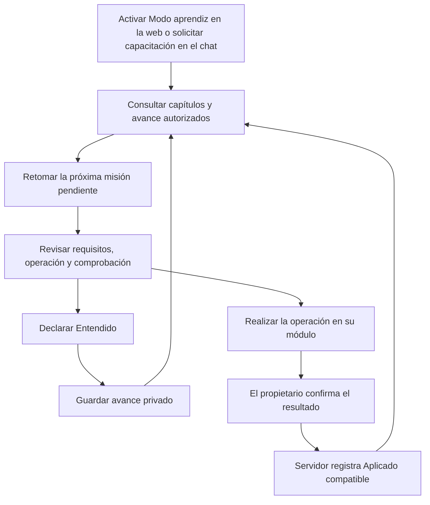

# Modo aprendiz: guía vigente y avance privado entre web y MCP

Estado: contrato aprobado para esta implementación, 2026-10-06. Extiende la sección 29 de
[Learning Mode](learning-mode-frontend-engine-v2.md) y el
[MCP Operating System](indice-mcp-operating-system-v1.md). No acredita despliegue en producción.

## 1. Propietarios y cobertura

`react/src/app/learningMode/curriculum.ts` contiene los flujos revisados en español de México e
inglés de Canadá. Su versión inicial comprende 58 capítulos en 10 módulos: configuración,
RH, procesos y tareas, gastos, caja chica, cartera, inventario, ventas, POS e indicadores.
Cada capítulo identifica módulo, pestaña, versión, etapa, requisitos, operación y comprobación.
La [matriz de cobertura](learning-function-coverage.md) documenta las acciones MCP compatibles.
Los capítulos de consulta pueden quedar Entendidos sin una operación aplicable integrada.
La cobertura no declara terminados módulos complementarios, administración de plataforma ni
habilitaciones comerciales de proveedores.

La web presenta estos pasos junto al acompañante existente. MCP consume el catálogo generado
del mismo contenido, no reconstruye instrucciones desde títulos ni textos antiguos. Cada
propietario mantiene sus formularios, reglas, permisos, registros y decisiones operativas.

Las seis etapas conservan este orden:

| Etapa | Aprendizaje |
| --- | --- |
| 1 | Empresa, unidades, negocios, usuarios y preferencias |
| 2 | Personas: alta, control, asistencia, permisos, nómina y gestión RH |
| 3 | Tareas, proyectos, procesos, versiones, ejecuciones y seguimiento |
| 4 | Gastos, fondos, comprobación, estados de cuenta y cobranza |
| 5 | Catálogo, almacén, movimientos, compras, ventas y administración POS |
| 6 | Indicadores e informes de fuentes operativas |

Panel Inicial no agrega acompañante interno. POS/Venta conserva su terminal y se enseña bajo
demanda en el chat, fuera del recorrido inicial. Contratos comerciales recibe su propio capítulo;
abrir esa pestaña no puede declarar entendido Contactos. El recorrido de Inventario conserva
Producto → Almacén → Inventario → Proveedor → Orden → Recepción.

## 2. Flujo para el usuario



El Dashboard muestra avance de las seis etapas y una continuación que abre la pestaña concreta.
Los acompañantes permiten entender una pestaña sin imponer bloqueos a la operación. Los casos
Emily, Juanito y Camila se eligen en el Dashboard y se guardan en las preferencias privadas de
usuario y empresa. En el chat se puede solicitar el caso y país apropiados; el MCP no necesita
consultar preferencias ni excepciones personales para leer una guía.

## 3. Estados, versiones y evidencia

- `pending`: el capítulo vigente no tiene declaración ni evidencia compatible.
- `understood`: declaración explícita del usuario para la versión actual del capítulo.
- `applied`: evidencia del servidor de una operación compatible realizada por ese usuario en
  esa empresa. Prevalece sobre Entendido en la presentación; la declaración se conserva aparte.

Aplicado acredita el uso de una operación del capítulo; no acredita dominio de cada control,
que una ficha esté completa, cumplimiento legal, certificación ni que todo el ciclo financiero
haya terminado. La primera misión de RH conserva su evaluación independiente de nueve requisitos.
`No aplica` sigue siendo una excepción didáctica privada con motivo y no modifica reglas RH.

Fuentes permitidas de Aplicado:

1. Commit MCP registrado por el propietario en `ai_action_audit_events`, con `COMMIT` y `SUCCESS`,
   cuyo nombre esté en la lista explícita `evidenceTools` del capítulo. Vista previa, errores y
   operaciones inciertas de terminal o reembolso no satisfacen esa lista.
2. Mutación web adoptada explícitamente con `@LearningApplied`, que retorna después del guardado
   del propietario. El propietario captura el usuario y empresa realmente utilizados con
   `LearningOperationContext.capture`. La proyección exige respuesta 2xx, cuerpo y ese actor;
   un cambio concurrente de sesión impide atribuir evidencia a otro actor. Las rutas con
   colecciones declaran una correspondencia finita en su controlador.

La proyección web es posterior al resultado del negocio. Un fallo de esa proyección deja la
operación empresarial guardada y registra una advertencia sin datos personales; ese intento
puede requerir otra operación compatible para reflejar Aplicado. No se introduce una transacción
distribuida ni se presenta un reintento empresarial como solución automática.

Navegar, exportar, abrir un modal, cargar una guía o guardar preferencias nunca marca Aplicado.
Ningún endpoint acepta esa declaración. La lista de evidencias requiere revisión del propietario
cuando cambien los requisitos; una operación histórica solo es compatible mientras siga
representando una acción válida del capítulo. Un cambio de requisitos incrementa `version` y
requiere una nueva declaración de Entendido. No se convierte memoria local antigua en prueba
del servidor. La versión inicial de este contrato es 2; los datos locales anteriores pueden
conservarse como memoria de presentación, sin acreditar automáticamente el capítulo revisado.

## 4. Persistencia y aislamiento

V304 añade `learning_chapter_progress`, `learning_journey_state` y `learning_operation_events`.
La [decisión de integración](decisions/2026-10-08-learning-migration-integration.md) conserva
el SQL de la antigua V300 de aprendizaje y exige revisar por separado las bases con ese historial.
Todas las consultas y escrituras incluyen usuario y empresa autenticados. La declaración es
única por usuario, empresa, capítulo y versión; reintentar no cambia su primera fecha.
Seleccionar una misión y declarar Entendido constituye un caso de uso transaccional.

Las preferencias de presentación, selección, caso y excepciones utilizan el propietario existente
de `workspace-state`, en `system/learning-view-*`, sin vencimiento automático. Su JSON no es
fuente de Aplicado. La migración local solo admite claves previamente aisladas por usuario y
empresa; el caso global anterior no se atribuye a un usuario nuevo.

La web descarta respuestas tardías de otro actor, serializa declaraciones y conserva cambios
fallidos para reintento. Los endpoints de progreso requieren `X-Learning-Actor` como precondición
contra cambios concurrentes de contexto; se compara con la sesión y nunca concede autoridad.
Las preferencias nuevas emplean la misma precondición. El servidor deriva el ámbito de la sesión.
El avance se actualiza al abrir la guía, recuperar el foco y mediante consulta cada 30 segundos.
No se promete actualización instantánea entre dispositivos. Cerrar sesión no elimina el avance
del servidor. Reiniciar la presentación no borra declaraciones, evidencias ni excepciones.

No existe parámetro para elegir otro usuario ni un panel para supervisar el aprendizaje ajeno.
La capacitación/certificación de consultores y distribuidores mantiene su propietario separado.

## 5. API y consentimiento MCP

| Herramienta | Consentimiento | Efecto |
| --- | --- | --- |
| `get_system_guide` | `learning.read` | Contenido vigente filtrado por permisos y herramientas actuales |
| `get_learning_progress` | `learning.read` | Avance privado, seis etapas y capítulos disponibles |
| `get_next_learning_mission` | `learning.read` | Próxima misión pendiente desde la selección, con vuelta a pendientes anteriores |
| `preview_update_learning_progress` | `learning.manage` | Prepara `start` o `understood`, sin cambiar progreso |
| `update_learning_progress` | `learning.manage` | Guarda exclusivamente el cambio confirmado |

`learning.manage` es una acción adicional y no se incorpora a conexiones existentes ni al
consentimiento predeterminado de lectura. Se solicita explícitamente en Integraciones/OAuth.
Preview requiere capítulo y versión actuales; admite `locale` es-MX/en-CA. Su token dura cinco
minutos y vincula conexión, usuario, empresa, membresía, herramienta y argumentos inmutables.
Commit solo acepta token y clave de idempotencia de 8 a 128 caracteres. Repetir el mismo commit
devuelve el avance filtrado con los permisos actuales; otra confirmación con la misma clave
produce conflicto. El servidor comprueba consentimiento y permisos también al repetir.
Los esquemas rechazan identidad, empresa, roles o argumentos operativos añadidos al commit.
Preview, commit, replay y denegaciones quedan auditados sin guardar tokens en claro.

Web: GET/POST `/api/v1/learning/progress?locale=...`, sesión actual y CSRF en POST.
MCP: POST `/api/v1/ai/tools/learning/progress`, `/preview`, `/commit`, bearer delegado.
No hay endpoints públicos nuevos. Se mantienen los interceptores de módulos/entitlements y
protecciones de tráfico existentes. ChatGPT no es el propietario de la persistencia.

## 6. Mantener la guía vigente

Al cambiar un flujo, el propietario debe revisar requisitos, pasos, comprobación y evidencia de
su capítulo en ambos idiomas; incrementar su versión si cambia lo que el usuario debe aprender.

```sh
node scripts/generate-lupita-learning-catalog.mjs
node scripts/generate-lupita-learning-catalog.mjs --check
```

La generación exige cubrir las pestañas del catálogo de permisos vigente, identificadores únicos,
pasos bilingües y nombres de evidencia presentes en el catálogo cerrado MCP. Un digest de pantallas
y propietarios invalida el catálogo ante cambios de implementación; CI verifica su vigencia y la
matriz. Este gate exige revisión humana del significado: regenerar no demuestra por sí solo que
las instrucciones describan correctamente una función nueva.

## 7. Entrega y rollback

Seguir [deployment/README.md](../deployment/README.md). Construir y publicar backend, frontend y
MCP de la misma revisión; aplicar V304 mediante Flyway antes de habilitar la nueva interfaz.
V304 es aditiva y no altera tablas del negocio. Un rollback restaura las imágenes anteriores y
conserva las tablas nuevas; no ejecuta migraciones inversas ni borra progreso o auditoría.

Antes del despliegue, comprobar migraciones y checksums frente a la base del entorno destino.
La prueba en una base nueva no certifica el historial de una base ya existente. Un checksum
inconsistente de versiones anteriores debe resolverse según el runbook y su revisión original;
no se corrige editando V304 ni reparando automáticamente una base operativa.

Verificación requerida: pruebas de aislamiento, versión, CSRF, permiso revocado, confirmación,
replay, proyección de evidencia y respuestas tardías; Flyway en base aislada; TypeScript, builds
de web/MCP y compilación backend. La activación real en ChatGPT y el smoke del ambiente desplegado
pertenecen a la entrega de ese ambiente.
