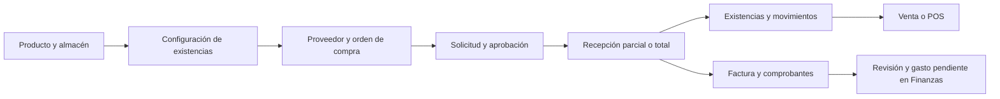

# Flujo operativo: Lupita, Inventarios, Ventas y POS

Fecha: 2026-10-06. Contrato: [cierre comercial](lupita-commerce-delivery-contract-v1.md).
Alcance: operaciones autenticadas sobre los módulos actuales de Índice. La aceptación pública y
las terminales reales siguen el [gate de publicación](indice-public-release-security-gate.md).

## 1. Preparar la operación

1. El administrador comprueba suscripción, módulos, pestañas, unidades, negocios y responsables.
2. Cada operador conecta su propia cuenta y concede únicamente las funciones que necesita.
   Las conexiones existentes no reciben permisos de escritura nuevos mediante refresh.
3. Lupita consulta el contexto actual y las guías disponibles. Las guías explican las 34 pestañas
   de los cinco módulos cubiertos, incluyendo RH y Procesos/Tareas. La lista de acciones depende
   de los permisos actuales del operador.
4. Antes de modificar registros, Lupita identifica el objeto, muestra la vista previa con sus
   efectos y solicita confirmación. La revisión vence en cinco minutos. Cambiar los datos exige
   una revisión nueva; reintentar una operación conserva la revisión y su clave original.

| Responsable | Operación |
| --- | --- |
| Administrador de empresa | Catálogo, almacenes, proveedores, descuentos, cajas, reglas y permisos dentro de su alcance |
| Compras / Inventarios | Reposición, recepción, traslados, conteos, facturas y evidencia |
| Ventas | Cliente, oportunidad, cotización, venta, entrega, contratos y seguimiento |
| Cajero | Su caja y turno, pedido reclamado, cobro, ticket y movimientos autorizados |
| Supervisor POS | Cortes, depósitos, devoluciones y recuperación autorizada |
| Finanzas / RH | Pago de proveedores, cartera, conciliación contable y pago de incentivos/nómina en sus módulos propietarios |

Los nombres de estos responsables describen el trabajo. No crean roles ni permisos nuevos.

## 2. Inventario y abastecimiento

1. Buscar primero el producto y el almacén. Crear o editar el catálogo con moneda, unidad de
   inventario, disponibilidad comercial/POS y fotografía opcional. Los servicios no tienen stock.
   El costo conserva cuatro decimales; la cantidad admite tres según su unidad. Las piezas son enteras.
2. Configurar existencias explícitamente: producto, almacén, uso de inventario y mínimo.
   La unidad y negocio se validan contra la asignación vigente. No enviar saldos calculados por el cliente.
3. Registrar el proveedor y su relación con productos, precio de compra, moneda, plazo y mínimo.
   Revisar las cotizaciones recibidas; enlazar productos existentes o rechazar partidas.
   Crear productos nuevos desde el catálogo antes de convertir una cotización de proveedor.
4. Crear la orden en borrador. Revisar proveedor, almacén, partidas, impuestos y fechas; editar
   solamente mientras sea borrador. Solicitar, aprobar y marcar como enviada mediante pasos separados.
   «Enviada» registra el estado interno; no acredita un correo entregado al proveedor.
5. Recibir las cantidades reales por partida. Las recepciones parciales dejan pendiente el resto.
   El backend rechaza partidas repetidas, exceso de recepción, servicios y monedas incompatibles.
6. Registrar la factura y adjuntar su archivo privado. Revisarla contra el proveedor/orden y
   aprobarla para pago cuando corresponda. El gasto resultante permanece pendiente; Finanzas registra
   el pago mediante su ciclo original. Adjuntar un archivo no paga ni aprueba una factura.
7. Consultar movimientos y mínimos. Entradas, salidas, traslados y conteos usan una revisión nueva.
   Los traslados conservan cantidad; las salidas respetan reservas. Cancelar un movimiento manual
   propio crea su compensación. Movimientos de venta/POS se revierten con el módulo que los originó.
8. Consultar historial y exportar productos, balances, movimientos, órdenes o facturas en CSV/PDF.

**Estado de cierre:** orden recibida o cancelada, stock e historial consistentes, factura revisada y,
si corresponde, gasto identificado para continuar en Finanzas. Los cambios no borran antecedentes.

## 3. Venta comercial

1. Identificar o registrar al cliente y la oportunidad con las herramientas comerciales existentes.
   Preparar y revisar la cotización: productos, cantidades, descuentos, impuestos y moneda.
2. Convertir la cotización guardada una sola vez, conservando sus partidas y moneda; el mismo
   paso registra la venta y marca la cotización como ganada. Una cotización vencida, rechazada o
   ya convertida no genera otra venta. También puede crearse una venta directa autorizada.
3. Revisar la venta y el almacén. El backend calcula totales, vendedor y comisiones. Si falta
   inventario, la operación completa queda pendiente de inventario; no entrega stock parcialmente.
   Los borradores sin aprobación pueden editarse; partidas con stock consumido conservan su historial.
4. Aprobar comercialmente y confirmar inventario pendiente con las herramientas específicas.
   Una venta procedente de POS conserva la autoridad de POS para su cobro y devolución.
5. Agregar evidencia de pago si existe y revisar el cobro. Confirmar efectivo/transferencia con
   cuenta elegible o usar crédito mediante la cartera existente. El archivo por sí solo no registra
   dinero. Una venta ya cobrada admite comprobantes complementarios sin regresar su aprobación a pendiente.
6. Registrar el estado real de entrega. Crear/editar el seguimiento posterior y cerrar o reactivar
   sus casos según el módulo. Crear contratos, adjuntar documentos y registrar revisión/cancelación.
   Una revisión interna de contrato no constituye una firma legal ni un envío externo.
7. Definir reglas de comisión y consultar sus cálculos. Crear el corte o programar los cortes
   con autoridad de Ventas y permiso de incentivos RH. El corte aplica incentivos una vez;
   el pago continúa en nómina. La vista previa usa el caché de tipo de cambio existente y
   no consulta proveedores de cambio ni crea registros.
8. Si corresponde cancelar una venta comercial, revisar primero devolución de stock y compensación
   del cobro. Confirmar crea las compensaciones originales y conserva la venta cancelada.
9. Exportar ventas o cortes de comisión con sus monedas nativas.

**Estado de cierre:** venta aprobada, inventario resuelto, cobro/cartera identificado, entrega
registrada y seguimiento/comisiones encaminados; o cancelación con compensaciones registradas.

## 4. POS: turno, cobro y cierre

1. Configurar la caja con su almacén y reglas de destino por moneda y medio de pago. La vista
   previa muestra los cambios normalizados sin crear cuentas. Tarjeta/wallet y destinos bancarios
   que lo requieren conservan depósito diferido y revisión.
2. Abrir el turno del operador con importe y moneda reales. Registrar entradas, salidas, depósitos
   o ajustes de efectivo permitidos con motivo; no confundirlos con ventas.
3. Buscar y reclamar un preticket o pedido de restaurante para esa caja/turno. Liberarlo si otro
   operador continuará. El backend conserva la reclamación y valida el pedido en el cobro.
4. Revisar productos, descuentos autorizados, impuestos, total, existencias y forma de pago.
   Confirmar efectivo/transferencia crea ticket, venta, movimiento de stock y efectos financieros
   mediante el propietario de checkout. Completar el cobro cierra su pedido de origen una vez.
5. Para tarjeta, usar la terminal asignada y verificada. Crear el intento confirmado con su
   identidad original; consultar/recuperar el resultado. Solo un pago aprobado **con ticket
   registrado** cierra la venta. Ante resultado incierto, continuar recuperación; no repetir el
   cobro con otra clave ni afirmar que se pagó. La cancelación respeta los estados del proveedor.
6. Cuando la caja compre inventario ya pagado, usar «recepción pagada POS»: proveedor, productos,
   cantidades, costo, impuesto y pago. Stock y salida de dinero son atómicos. Adjuntar recibo opcional.
   Para corregir, usar la reversión de esa recepción, con motivo y autorización.
7. Antes de cerrar, resolver intentos de terminal y devoluciones activas. Contar efectivo real;
   revisar ventas, movimientos, devoluciones y diferencia. Confirmar el corte conserva su historial.
8. Revisar depósitos pendientes. Confirmar el importe realmente recibido y explicar diferencias;
   el backend registra el movimiento y el estado de conciliación. Consultar cortes y exportar
   tickets del turno, cortes o depósitos de un corte específico. El historial paginado conserva
   registros posteriores al límite antiguo de 300 tickets.

**Estado de cierre:** turno cerrado, corte registrado y depósitos confirmados o identificados para
conciliación. Un depósito pendiente no se presenta como dinero recibido.

## 5. Devoluciones y recuperación

| Caso | Acción y resultado |
| --- | --- |
| Efectivo | Preparar devolución completa del ticket original; confirmar entrega física del dinero. Reponer stock y compensar caja una vez |
| Transferencia | Identificar cada pago original y registrar su comprobante de devolución, con referencia válida. No registrar otra forma de pago |
| Tarjeta Square / Point | Preparar devolución física; confirmar mediante el proveedor original. Con resultado pendiente no reponer stock |
| Reembolso confirmado y error de stock | Conservar evidencia financiera; corregir la causa y recuperar la devolución. Point reutiliza el reembolso confirmado sin otra solicitud externa |
| Reembolso separado del pago | Usar las operaciones financieras del proveedor y su recuperación. No duplica una devolución física activa/completada ni repone inventario por sí mismo |
| Proveedor rechaza definitivamente | Consultar evidencia y conciliar. La preparación puede cancelarse cuando todos sus pagos son rechazados/fallidos, según el propietario |
| Turno cerrado o venta contabilizada | Mantener el bloqueo original y continuar con Finanzas; no inventar una devolución de stock ni reabrir registros desde el agente |
| Confirmación vencida o datos cambiados | Preparar una revisión nueva. No reutilizar una confirmación para otra operación |
| Respuesta perdida | Consultar el resultado o reintentar explícitamente con la misma clave. No crear otro pago, movimiento, corte o adjunto |

El alcance automático de devolución física es **completo**, sobre medios originales compatibles.
Devoluciones parciales de partidas, crédito/wallet o mezcla de tarjeta requieren el flujo financiero
propietario y no se presentan como operaciones disponibles del agente.

## 6. México y Canadá

| Operación | México | Canadá |
| --- | --- | --- |
| Guías y conversación | Español y contexto autorizado | Inglés canadiense o idioma elegido, mismo contexto autorizado |
| Venta / inventario | Moneda nativa del registro; no convertir por preferencia visual | Moneda nativa del registro; CAD cuando así esté configurado |
| Terminal | Point solamente con conexión México/MLM, MXN, dispositivo verificado y gates actuales; Square según configuración autorizada | Square según país, moneda y conexión verificados; Point México no se habilita por elegir CAD |
| Soporte | Canal existente de consultoría/soporte cuando esté asignado | Canal existente de soporte cuando no haya consultor asignado |
| Puesta en operación | Configuración y permisos del administrador, capacitación y pruebas | Mismos controles, guías autónomas y soporte; no depende de un consultor para consultar los pasos |

Los gates de hardware, merchant y activación se conservan. Lupita no conecta credenciales,
verifica identidad física ni habilita cobros LIVE por una instrucción en el chat.

## 7. Archivos y reportes

1. Seleccionar destino explícito: fotografía de producto, evidencia de venta, contrato, factura de
   proveedor o recibo POS. La entrada nativa de ChatGPT usa la lista de hosts verificada en APPTEST;
   sin esa configuración falla cerrada. La entrada de bytes conserva su límite y permisos.
2. Cargar archivo, revisar nombre, formato, tamaño y destino, y confirmar su registro privado.
   El registro temporal vence a los 15 minutos; reservas abandonadas se limpian con el servicio existente.
3. Consultar adjuntos y descargar recursos privados con permiso de archivo y del registro propietario.
   Una alteración de contenido después del registro se rechaza. No publicar enlaces firmados o bytes
   en auditorías. Los documentos primarios antiguos de proveedor conservan su canal original del navegador.
4. Exportar uno de los diez reportes admitidos en CSV/PDF. Las fechas usan un rango máximo de 366 días
   cuando corresponde; el límite es 5,000 filas/10 MB. Reducir filtros si se rebasa. CSV conserva
   Unicode y evita fórmulas de hoja de cálculo; PDF usa la tipografía existente y puede sustituir
   caracteres que esa tipografía no soporte. No sumar monedas distintas como si fueran una sola.

## 8. Handoff

La [matriz exacta de herramientas](lupita-commerce-tool-matrix-v1.md) y la
[validación y entrega a despliegue](validation/2026-10-06-lupita-commerce-cycles.md) acompañan
este documento. El operador de release debe seguir el [procedimiento de despliegue](../deployment/README.md), probar APPTEST
con datos sintéticos y registrar los gates pendientes antes de habilitar acciones financieras.
Este flujo no acredita aceptación en ChatGPT real, terminales físicas ni producción.
