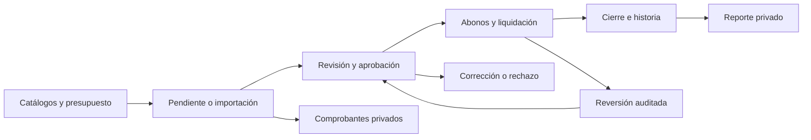
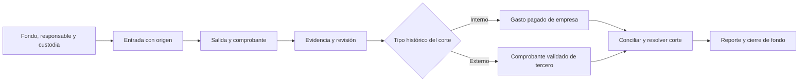

# Flujo operativo final: Lupita, Gastos y Caja Chica

Fecha: 2026-10-07. Contrato: [operación financiera](lupita-finance-delivery-contract-v1.md).
Uso: guía para administradores y operadores con acceso vigente a sus módulos y pestañas.

## 1. Preparar el acceso

El administrador asigna unidades, negocios, módulos y pestañas. Cada operador conecta su propia
cuenta y elige las acciones necesarias. Las conexiones anteriores necesitan conceder los permisos
nuevos para usarlas. Lupita consulta contexto, herramientas disponibles y guía del módulo.

Antes de guardar, muestra registro, importe, moneda, cuenta, fecha y efecto. Solo después de una
confirmación aplica el cambio. Si la revisión vence o cambió el registro, presenta una nueva.
Si se perdió la respuesta, reintenta con la misma confirmación y clave para recuperar el resultado.

## 2. Gastos

1. **Preparar:** consultar/crear proveedor, cuenta contable, cuenta de pago y presupuesto.
   Editar/inactivar usa las reglas actuales y conserva historia. Los saldos de cuenta los calcula
   Tesorería. Una cuenta del sistema no se convierte en una cuenta editable común.
2. **Capturar:** crear una cuenta por pagar con concepto, ámbito, moneda, total y fechas, o revisar
   un lote de hasta 200 capturas. Un registro importado solo se guarda pagado cuando se eligió
   expresamente y el operador tiene permiso de pago. Compras/presupuestos continúan en su origen.
3. **Programar obligaciones:** elegir presupuesto, periodo, frecuencia y tasa incluida explícita.
   Se crean renglones finitos; el sistema genera su pendiente en el mes correspondiente.
   Consultar las revisiones de obligaciones cuando falte una referencia o exista un bloqueo.
4. **Adjuntar:** elegir el gasto/renglón exacto, cargar PDF o fotografía, revisar archivo y destino,
   y confirmar su registro privado. El documento por sí solo no paga ni aprueba el gasto.
5. **Revisar:** enviar a aprobación; aprobar o rechazar con razón. Clasificar o actualizar
   vencimientos individualmente/en lote conservando los abonos y fuentes protegidas.
6. **Pagar:** registrar un abono con cuenta elegible o liquidar el saldo que calcula Índice.
   Si se elige una liquidación sin cuenta asignada, mostrarlo expresamente: queda historia de
   pago sin simular débito bancario. Los pagos en lote usan la cuenta revisada y el saldo de cada fila.
7. **Corregir:** editar mediante corrección auditada, sin borrar abonos existentes. Para un abono
   equivocado, revertir el último activo permitido; para retirar un gasto, revisar las compensaciones
   financieras/contables. Las operaciones de fondo se corrigen en Caja Chica.
8. **Cerrar:** cerrar el pagado y consultar sus pagos/reversiones. Exportar gastos, abonos,
   presupuestos o renglones en CSV/PDF privado, con moneda, fechas y alcance.

**Ciclo cerrado:** gasto pagado y cerrado con historia coherente; o rechazo/cancelación/retiro
permitidos con evidencia y compensaciones conservadas. Una cuenta pendiente puede quedar abierta
legítimamente hasta su fecha de pago.

Ejemplo: «Registra un pendiente de 113 CAD con impuesto incluido de 13 %, para este proveedor,
con vencimiento el viernes. Muéstrame el subtotal, impuesto y cuenta antes de guardarlo».
La tasa del ejemplo no es una recomendación fiscal ni se aplica automáticamente a otras operaciones.

## 3. Caja Chica

1. **Configurar:** fondo interno con presupuesto o fondo externo con identidad del propietario,
   responsable, moneda y cuenta de custodia. Se crea con saldo cero.
2. **Fondear:** revisar cuenta de origen u origen externo nombrado, importe, fecha y referencia.
   El sistema registra la entrada y sus movimientos una vez.
3. **Capturar:** registrar cada salida con su comprobante, fecha y total. Capturar ya descuenta
   la custodia. Adjuntar fotografía/PDF de forma privada y clasificar los registros elegibles.
4. **Autorizar:** un comprobante interno crea su gasto pagado; el externo valida la salida del
   tercero. Autorizar no repite el descuento realizado en la captura.
5. **Resolver errores:** rechazar conserva la salida pendiente de aclaración. Si la captura era
   equivocada, revisar y confirmar su reversión permitida y volver a capturar la correcta.
6. **Cerrar corte:** resolver comprobantes pendientes, revisar el saldo firmado y elegir:

| Saldo y decisión | Resultado |
| --- | --- |
| Cero: cierre limpio | Corte cerrado sin movimiento adicional. |
| Positivo: devolución | Saldo devuelto a la cuenta o destino externo nombrado que se confirmó. |
| No cero: traslado | Saldo conservado como apertura del corte siguiente. |
| Negativo: condonar faltante | Diferencia resuelta con su ajuste e historia. |
| Positivo: condonar sobrante | Diferencia resuelta con su ajuste e historia. |
| Negativo: cargo al responsable | Obligación creada en RH, pendiente de aplicación manual en Nómina. |

7. **Cerrar fondo:** saldo cero, todos los cortes resueltos y sin cambio de tipo pendiente.
   Un fondo que continuará operando puede quedar abierto con su siguiente corte.
8. **Reportar:** exportar fondos, cortes, comprobantes o movimientos privados. El reporte del
   tercero conserva la identidad y activos históricos del corte.
9. **Cambios futuros:** programar/cancelar una etapa interna/externa conserva la historia anterior.
   Activación de etapas sigue el proceso nativo. Administrar kiosco conserva sus credenciales privadas
   y el acceso público protegido de Índice.

**Ciclo cerrado:** salidas revisadas, dinero conciliado, corte resuelto y siguiente corte/fondo
en estado consistente. Dinero externo permanece separado del dinero propio de la empresa.

## 4. Seguimiento y aprendizaje

Preguntar «¿qué sigue?» devuelve las acciones disponibles según estado y permisos actuales.
Consultar la guía de Gastos o Caja Chica enseña sus pestañas y recorridos actualizados.
El progreso sigue siendo privado por usuario/empresa; Aplicado se apoya en operaciones reales.

Los reportes recorren toda la selección autorizada: hasta 5,000 filas y 10 MB. Cuando se supera
el límite se solicita reducir filtros. Los totales de las consultas cubren toda la selección,
sin mezclar monedas ni fondos internos con externos.

La entrega local y sus evidencias están en el [reporte final](lupita-finance-delivery-2026-10-07.md).
Despliegue y aceptación con el cliente real continúan mediante el runbook de liberación.
