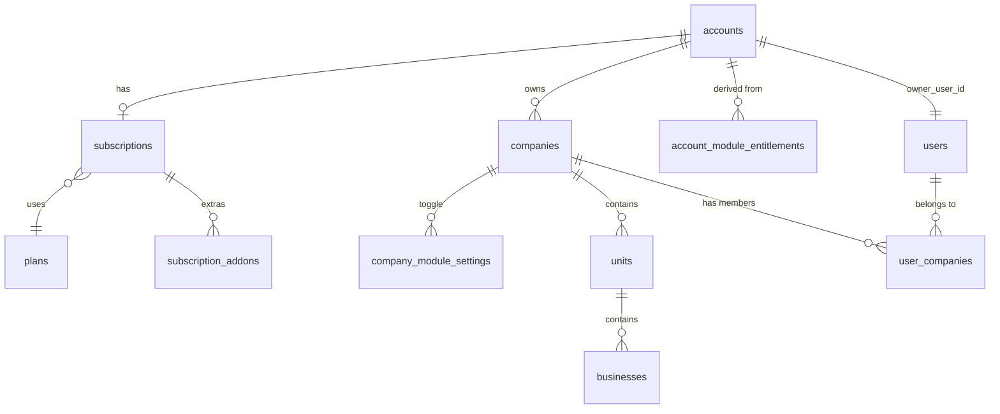

# 3. Multi-tenant data model

## 3.1 General principle

**One new layer** (`accounts`) is added above the current hierarchy, plus **three new families of
tables** (billing/plan, entitlements, and Stripe idempotency utilities). The
`companies → units → businesses` hierarchy **doesn't change shape**, it just gains a parent.

```
accounts (NEW)                                       ← owner, billing, plan, seats
 ├── plans / subscriptions / subscription_addons      ← what was purchased (NEW)
 ├── account_module_entitlements                      ← what can be used, derived from the above (NEW)
 └── companies (EXISTING, gains an account_id column)
      ├── company_module_settings                     ← per-company on/off within what's entitled (NEW)
      ├── units (EXISTING, no shape change)
      │    └── businesses (EXISTING, no shape change)
      └── ... everything else in HR/config-center (EXISTING, no shape change)
```

## 3.2 Design decision: entitlements at the account level

**Question**: if the owner buys the "Inventory" module, does it apply to all their companies, or
does each one have to pay for it separately?

**Recommended decision: at the `account` level.** The owner pays once and the module becomes
available for all their companies; each company can *turn it off* individually if it doesn't need
it (`company_module_settings`, see 3.4), but it cannot *turn it on* if the account hasn't purchased
it.

**Why**: it's the model the user explicitly asked for ("all modules should be... for the same
owner but business units or different businesses") and it's also the simplest to bill in Stripe
(one subscription per Account, not N subscriptions per Company). The trade-off is that an owner
with very different businesses (e.g. restaurant + real estate) pays for modules they only use in
one of their companies — mitigated by the per-company toggle, and if charging differently per
company is needed in the future, `subscription_addons` can evolve to reference `company_id`
instead of only `account_id` without breaking the rest of the model.

## 3.3 New tables — Account and billing

```sql
-- V20__accounts.sql
CREATE TABLE `accounts` (
  `id` bigint NOT NULL AUTO_INCREMENT,
  `name` varchar(160) NOT NULL,               -- owner/group name, e.g. "Sazón Group"
  `owner_user_id` bigint NOT NULL,
  `status` varchar(20) NOT NULL DEFAULT 'active',   -- active | suspended | canceled
  `stripe_customer_id` varchar(64) DEFAULT NULL UNIQUE,
  `default_locale` varchar(10) DEFAULT 'es-MX',
  `created_at` timestamp NULL DEFAULT CURRENT_TIMESTAMP,
  `updated_at` timestamp NULL DEFAULT CURRENT_TIMESTAMP ON UPDATE CURRENT_TIMESTAMP,
  PRIMARY KEY (`id`),
  KEY `idx_accounts_owner` (`owner_user_id`),
  CONSTRAINT `fk_accounts_owner` FOREIGN KEY (`owner_user_id`) REFERENCES `users` (`id`)
) ENGINE=InnoDB DEFAULT CHARSET=utf8mb4;

ALTER TABLE `companies`
  ADD COLUMN `account_id` bigint NULL AFTER `id`,
  ADD KEY `idx_companies_account` (`account_id`),
  ADD CONSTRAINT `fk_companies_account` FOREIGN KEY (`account_id`) REFERENCES `accounts` (`id`) ON DELETE CASCADE;
-- left NULLABLE in this migration on purpose: the backfill (V21) fills it in and a later
-- migration (V22, after verifying 100% coverage) can harden it to NOT NULL.
```

```sql
-- V21__accounts_backfill.sql
-- Creates one account per existing company, with owner = the user with
-- the best role in user_companies for that company (same criterion login uses today).
INSERT INTO accounts (name, owner_user_id, status, created_at)
SELECT c.name, best_owner.user_id, 'active', c.created_at
FROM companies c
JOIN (
  SELECT uc.company_id, uc.user_id,
         ROW_NUMBER() OVER (
           PARTITION BY uc.company_id
           ORDER BY FIELD(uc.role, 'admin','superadmin','owner') DESC, uc.created_at ASC
         ) AS rn
  FROM user_companies uc
) best_owner ON best_owner.company_id = c.id AND best_owner.rn = 1;

UPDATE companies c
JOIN accounts a ON a.owner_user_id = (
  SELECT uc.user_id FROM user_companies uc
  WHERE uc.company_id = c.id ORDER BY FIELD(uc.role,'admin','superadmin','owner') DESC LIMIT 1
) AND a.name = c.name
SET c.account_id = a.id
WHERE c.account_id IS NULL;
```

> Implementation note: this backfill assumes **1 pre-existing company → 1 new account** (no
> current owner yet manages several grouped companies, because that possibility didn't exist
> before). A real owner who today administers 2 companies with the same admin user in both will
> end up with 2 separate accounts after the automatic backfill — this is intentional (grouping
> that the user never declared cannot be inferred) and is resolved with an "account merge"
> support/admin tool if the business asks for it, out of scope for the automatic migration.

```sql
-- V23__billing_plans.sql
CREATE TABLE `plans` (
  `id` bigint NOT NULL AUTO_INCREMENT,
  `code` varchar(40) NOT NULL UNIQUE,          -- 'starter' | 'growth' | 'scale'
  `name` varchar(100) NOT NULL,
  `tier_level` int NOT NULL,                   -- 1=free/basic, 2=pro, 3=enterprise (maps to modules.tier)
  `included_seats` int NOT NULL,
  `seat_overage_price_cents` int NOT NULL DEFAULT 0,   -- price per extra user
  `base_price_cents` int NOT NULL,
  `billing_interval` varchar(10) NOT NULL DEFAULT 'month',  -- month | year
  `stripe_product_id` varchar(64) DEFAULT NULL,
  `stripe_price_id` varchar(64) DEFAULT NULL,
  `is_active` tinyint(1) NOT NULL DEFAULT 1,
  `sort_order` int NOT NULL DEFAULT 0,
  PRIMARY KEY (`id`)
) ENGINE=InnoDB DEFAULT CHARSET=utf8mb4;

CREATE TABLE `subscriptions` (
  `id` bigint NOT NULL AUTO_INCREMENT,
  `account_id` bigint NOT NULL UNIQUE,          -- one active subscription per account
  `plan_id` bigint NOT NULL,
  `stripe_subscription_id` varchar(64) DEFAULT NULL UNIQUE,
  `status` varchar(20) NOT NULL DEFAULT 'trialing', -- trialing|active|past_due|canceled|incomplete
  `seat_quantity` int NOT NULL DEFAULT 0,       -- included + overage currently purchased
  `current_period_start` timestamp NULL DEFAULT NULL,
  `current_period_end` timestamp NULL DEFAULT NULL,
  `trial_end` timestamp NULL DEFAULT NULL,
  `cancel_at_period_end` tinyint(1) NOT NULL DEFAULT 0,
  `created_at` timestamp NULL DEFAULT CURRENT_TIMESTAMP,
  `updated_at` timestamp NULL DEFAULT CURRENT_TIMESTAMP ON UPDATE CURRENT_TIMESTAMP,
  PRIMARY KEY (`id`),
  CONSTRAINT `fk_subscriptions_account` FOREIGN KEY (`account_id`) REFERENCES `accounts` (`id`) ON DELETE CASCADE,
  CONSTRAINT `fk_subscriptions_plan` FOREIGN KEY (`plan_id`) REFERENCES `plans` (`id`)
) ENGINE=InnoDB DEFAULT CHARSET=utf8mb4;

CREATE TABLE `subscription_addons` (
  `id` bigint NOT NULL AUTO_INCREMENT,
  `subscription_id` bigint NOT NULL,
  `module_slug` varchar(50) NOT NULL,
  `stripe_subscription_item_id` varchar(64) DEFAULT NULL,
  `unit_price_cents` int NOT NULL,
  `status` varchar(20) NOT NULL DEFAULT 'active',   -- active | canceled
  `created_at` timestamp NULL DEFAULT CURRENT_TIMESTAMP,
  PRIMARY KEY (`id`),
  UNIQUE KEY `uq_subscription_module` (`subscription_id`, `module_slug`),
  CONSTRAINT `fk_addons_subscription` FOREIGN KEY (`subscription_id`) REFERENCES `subscriptions` (`id`) ON DELETE CASCADE
) ENGINE=InnoDB DEFAULT CHARSET=utf8mb4;
```

```sql
-- V24__billing_entitlements.sql
CREATE TABLE `account_module_entitlements` (
  `account_id` bigint NOT NULL,
  `module_slug` varchar(50) NOT NULL,
  `source` varchar(20) NOT NULL,          -- 'plan' | 'addon' | 'trial' | 'grandfathered'
  `enabled` tinyint(1) NOT NULL DEFAULT 1,
  `expires_at` timestamp NULL DEFAULT NULL,
  `updated_at` timestamp NULL DEFAULT CURRENT_TIMESTAMP ON UPDATE CURRENT_TIMESTAMP,
  PRIMARY KEY (`account_id`, `module_slug`),
  CONSTRAINT `fk_entitlements_account` FOREIGN KEY (`account_id`) REFERENCES `accounts` (`id`) ON DELETE CASCADE
) ENGINE=InnoDB DEFAULT CHARSET=utf8mb4;

CREATE TABLE `company_module_settings` (
  `company_id` bigint NOT NULL,
  `module_slug` varchar(50) NOT NULL,
  `enabled` tinyint(1) NOT NULL DEFAULT 1,   -- manual toggle by the company admin, subordinate to the account's entitlement
  `updated_at` timestamp NULL DEFAULT CURRENT_TIMESTAMP ON UPDATE CURRENT_TIMESTAMP,
  PRIMARY KEY (`company_id`, `module_slug`),
  CONSTRAINT `fk_company_module_company` FOREIGN KEY (`company_id`) REFERENCES `companies` (`id`) ON DELETE CASCADE
) ENGINE=InnoDB DEFAULT CHARSET=utf8mb4;
```

`account_module_entitlements` is a **derived/cached** table: recomputed whenever the plan or
add-ons change (when processing a Stripe webhook, see
[06-stripe-billing-integration.md](06-stripe-billing-integration.md)). Final access rule for a
user to reach a module in a company:

```
access = a row exists in account_module_entitlements (account_id, module_slug) with enabled=1
         and (expires_at IS NULL or expires_at > now())
         AND NO row exists in company_module_settings (company_id, module_slug) with enabled=0
```

If there's no row in `company_module_settings`, it's assumed enabled (default = everything
entitled is visible in every company, until an admin explicitly turns it off per company).

```sql
-- V25__stripe_events.sql — webhook idempotency
CREATE TABLE `stripe_events` (
  `id` bigint NOT NULL AUTO_INCREMENT,
  `stripe_event_id` varchar(64) NOT NULL UNIQUE,
  `type` varchar(80) NOT NULL,
  `payload_json` json NOT NULL,
  `status` varchar(20) NOT NULL DEFAULT 'received',  -- received | processed | failed
  `error_message` text DEFAULT NULL,
  `received_at` timestamp NULL DEFAULT CURRENT_TIMESTAMP,
  `processed_at` timestamp NULL DEFAULT NULL,
  PRIMARY KEY (`id`)
) ENGINE=InnoDB DEFAULT CHARSET=utf8mb4;
```

Optional (recommended so `Billing.tsx` doesn't have to be rebuilt from the Stripe API every time
it renders, even though Stripe stays the source of truth):

```sql
-- V26__billing_cache.sql (optional, improves the Billing screen's UX)
CREATE TABLE `account_invoices` (
  `id` bigint NOT NULL AUTO_INCREMENT,
  `account_id` bigint NOT NULL,
  `stripe_invoice_id` varchar(64) NOT NULL UNIQUE,
  `amount_due_cents` int NOT NULL,
  `amount_paid_cents` int NOT NULL,
  `status` varchar(20) NOT NULL,           -- draft|open|paid|uncollectible|void
  `hosted_invoice_url` varchar(500) DEFAULT NULL,
  `period_start` timestamp NULL DEFAULT NULL,
  `period_end` timestamp NULL DEFAULT NULL,
  `created_at` timestamp NULL DEFAULT CURRENT_TIMESTAMP,
  PRIMARY KEY (`id`),
  KEY `idx_invoices_account` (`account_id`),
  CONSTRAINT `fk_invoices_account` FOREIGN KEY (`account_id`) REFERENCES `accounts` (`id`) ON DELETE CASCADE
) ENGINE=InnoDB DEFAULT CHARSET=utf8mb4;
```

With `account_invoices` in place, storing our own cards is **not** recommended — use the Stripe
Customer Portal for payment-method management instead (see 06). This keeps the project out of
PCI-DSS scope.

## 3.4 Seat calculation (no new table)

An Account's "used" seat count is calculated, not stored:

```sql
SELECT COUNT(DISTINCT uc.user_id)
FROM user_companies uc
JOIN companies c ON c.id = uc.company_id
WHERE c.account_id = :accountId AND uc.status = 'active';
```

Compared against `subscriptions.seat_quantity`. If an owner tries to invite a new user and that
count already reaches `seat_quantity`, the backend must block the invitation and offer an upgrade
or an extra-seat purchase (see [04](04-backend-architecture.md) and
[06](06-stripe-billing-integration.md) for the overage billing flow).

## 3.5 Fixes to the current schema (independent of whether SaaS is built)

Include in the same migration batch (`V20`-`V22`) since they touch the same tables:

```sql
-- Close the cross-tenant leak (see 02-current-state-audit, section 2.4)
UPDATE units SET company_id = <correct company_id> WHERE company_id IS NULL;   -- resolve case by case first
ALTER TABLE units MODIFY company_id bigint NOT NULL;
UPDATE businesses SET company_id = <correct company_id> WHERE company_id IS NULL;
ALTER TABLE businesses MODIFY company_id bigint NOT NULL;

-- Prevent duplicate user-company memberships
ALTER TABLE user_companies ADD UNIQUE KEY uq_user_company (user_id, company_id);

-- Real FKs on hr_employees for unit/business (today they're loose columns)
ALTER TABLE hr_employees
  ADD CONSTRAINT fk_hr_employees_unit FOREIGN KEY (unit_id) REFERENCES units(id) ON DELETE SET NULL,
  ADD CONSTRAINT fk_hr_employees_business FOREIGN KEY (business_id) REFERENCES businesses(id) ON DELETE SET NULL;

-- Favorites should be per-company, not global per-user
ALTER TABLE user_module_favorites ADD COLUMN company_id bigint NOT NULL AFTER user_id;
ALTER TABLE user_module_favorites DROP PRIMARY KEY, ADD PRIMARY KEY (user_id, company_id, module_slug);
ALTER TABLE user_module_favorites
  ADD CONSTRAINT fk_favorites_company FOREIGN KEY (company_id) REFERENCES companies(id) ON DELETE CASCADE;
```

Removing the `OR company_id IS NULL` fallback in `OrganizationService`/`HrAttendanceService` is a
**code** change, not a schema one — covered in
[04-backend-architecture.md](04-backend-architecture.md).

## 3.6 Roles per unit/business?

Today the finest-grained role that exists is `user_company_module_roles` (role per module, within
a company). There's no role per `unit`/`business`. **Recommendation: don't build this in the first
phase.** An owner with several companies already solves 90% of the "separate my businesses" case
at the `company` level (each business is its own company, with its own users in
`user_companies`). A role per `unit`/`business` within the same company is a later-phase
refinement — document it as a future extension of `user_company_module_roles` by adding nullable
`scope_type`/`scope_id` columns, without blocking the SaaS MVP.

## 3.7 ER diagram (high level, new pieces highlighted)


