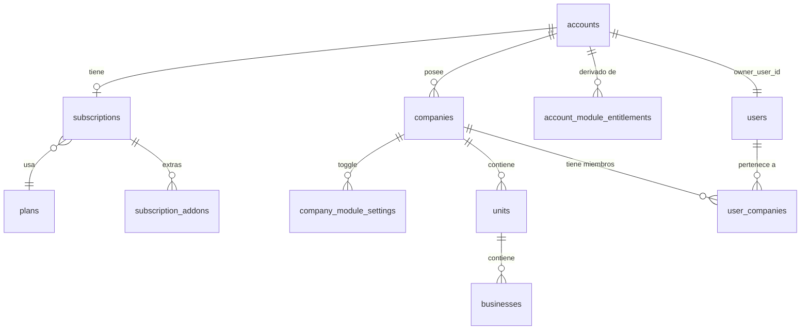

# 3. Modelo de datos multi-tenant

## 3.1 Principio general

Se agrega **una capa nueva** (`accounts`) por encima de la jerarquía actual, y **tres familias de
tablas nuevas** (billing/plan, entitlements, y utilidades de idempotencia de Stripe). La jerarquía
`companies → units → businesses` **no cambia de forma**, solo gana un padre.

```
accounts (NUEVO)                                    ← dueño, facturación, plan, seats
 ├── plans / subscriptions / subscription_addons     ← qué compró (NUEVO)
 ├── account_module_entitlements                     ← qué puede usar, derivado de lo anterior (NUEVO)
 └── companies (EXISTENTE, gana columna account_id)
      ├── company_module_settings                    ← on/off por empresa dentro de lo entitled (NUEVO)
      ├── units (EXISTENTE, sin cambios de forma)
      │    └── businesses (EXISTENTE, sin cambios de forma)
      └── ... todo lo demás de HR/config-center (EXISTENTE, sin cambios de forma)
```

## 3.2 Decisión de diseño: entitlements a nivel de `account`

**Pregunta**: si el dueño compra el módulo "Inventario", ¿aplica a todas sus empresas o hay que
pagarlo por cada una?

**Decisión recomendada: a nivel de `account`.** El dueño paga una vez y el módulo queda disponible
para todas sus companies; cada company puede *desactivarlo* individualmente si no lo necesita
(`company_module_settings`, ver 3.4), pero no puede *activarlo* si la cuenta no lo tiene contratado.

**Por qué**: es el modelo que pidió el usuario explícitamente ("todos los módulos deban ser... para
un mismo dueño pero unidades de negocio o diferentes negocios") y es también el más simple de
facturar en Stripe (una sola suscripción por Account, no N suscripciones por Company). El costo es
que un dueño con negocios muy distintos (ej. restaurante + inmobiliaria) paga por módulos que solo
usa en una de sus empresas — se mitiga con el toggle por-company y, si en el futuro se necesita
cobrar distinto por empresa, se puede evolucionar `subscription_addons` para referenciar
`company_id` en vez de solo `account_id` sin romper el resto del modelo.

## 3.3 Tablas nuevas — Account y billing

```sql
-- V20__accounts.sql
CREATE TABLE `accounts` (
  `id` bigint NOT NULL AUTO_INCREMENT,
  `name` varchar(160) NOT NULL,               -- nombre del dueño/grupo, ej. "Grupo Sazón"
  `owner_user_id` bigint NOT NULL,
  `status` varchar(20) NOT NULL DEFAULT 'active',   -- active | suspended | canceled
  `stripe_customer_id` varchar(64) DEFAULT NULL UNIQUE,
  `default_locale` varchar(10) DEFAULT 'es-MX',
  `created_at` timestamp NULL DEFAULT CURRENT_TIMESTAMP,
  `updated_at` timestamp NULL DEFAULT CURRENT_TIMESTAMP ON UPDATE CURRENT_TIMESTAMP,
  PRIMARY KEY (`id`),
  KEY `idx_accounts_owner` (`owner_user_id`),
  CONSTRAINT `fk_accounts_owner` FOREIGN KEY (`owner_user_id`) REFERENCES `users` (`id`)
) ENGINE=InnoDB DEFAULT CHARSET=utf8mb4;

ALTER TABLE `companies`
  ADD COLUMN `account_id` bigint NULL AFTER `id`,
  ADD KEY `idx_companies_account` (`account_id`),
  ADD CONSTRAINT `fk_companies_account` FOREIGN KEY (`account_id`) REFERENCES `accounts` (`id`) ON DELETE CASCADE;
-- se deja NULLABLE en esta migración a propósito: el backfill (V21) lo llena y una migración
-- posterior (V22, tras verificar 100% de cobertura) lo puede endurecer a NOT NULL.
```

```sql
-- V21__accounts_backfill.sql
-- Crea una account por cada company existente, con owner = el usuario con
-- mejor rol en user_companies para esa company (mismo criterio que hoy usa el login).
INSERT INTO accounts (name, owner_user_id, status, created_at)
SELECT c.name, best_owner.user_id, 'active', c.created_at
FROM companies c
JOIN (
  SELECT uc.company_id, uc.user_id,
         ROW_NUMBER() OVER (
           PARTITION BY uc.company_id
           ORDER BY FIELD(uc.role, 'admin','superadmin','owner') DESC, uc.created_at ASC
         ) AS rn
  FROM user_companies uc
) best_owner ON best_owner.company_id = c.id AND best_owner.rn = 1;

UPDATE companies c
JOIN accounts a ON a.owner_user_id = (
  SELECT uc.user_id FROM user_companies uc
  WHERE uc.company_id = c.id ORDER BY FIELD(uc.role,'admin','superadmin','owner') DESC LIMIT 1
) AND a.name = c.name
SET c.account_id = a.id
WHERE c.account_id IS NULL;
```

> Nota de implementación: este backfill asume **1 company preexistente → 1 account nueva**
> (ningún dueño actual tiene aún varias empresas agrupadas, porque esa posibilidad no existía). Un
> dueño real que hoy administra 2 companies con el mismo usuario admin en ambas terminará con 2
> accounts separadas tras el backfill automático — es intencional (no se puede inferir agrupación
> que el usuario nunca declaró) y se resuelve con una herramienta de "fusionar accounts" de
> soporte/admin si el negocio la pide, fuera del alcance de la migración automática.

```sql
-- V23__billing_plans.sql
CREATE TABLE `plans` (
  `id` bigint NOT NULL AUTO_INCREMENT,
  `code` varchar(40) NOT NULL UNIQUE,          -- 'starter' | 'growth' | 'scale'
  `name` varchar(100) NOT NULL,
  `tier_level` int NOT NULL,                   -- 1=free/basic, 2=pro, 3=enterprise (mapea a modules.tier)
  `included_seats` int NOT NULL,
  `seat_overage_price_cents` int NOT NULL DEFAULT 0,   -- precio por usuario extra
  `base_price_cents` int NOT NULL,
  `billing_interval` varchar(10) NOT NULL DEFAULT 'month',  -- month | year
  `stripe_product_id` varchar(64) DEFAULT NULL,
  `stripe_price_id` varchar(64) DEFAULT NULL,
  `is_active` tinyint(1) NOT NULL DEFAULT 1,
  `sort_order` int NOT NULL DEFAULT 0,
  PRIMARY KEY (`id`)
) ENGINE=InnoDB DEFAULT CHARSET=utf8mb4;

CREATE TABLE `subscriptions` (
  `id` bigint NOT NULL AUTO_INCREMENT,
  `account_id` bigint NOT NULL UNIQUE,          -- una suscripción activa por account
  `plan_id` bigint NOT NULL,
  `stripe_subscription_id` varchar(64) DEFAULT NULL UNIQUE,
  `status` varchar(20) NOT NULL DEFAULT 'trialing', -- trialing|active|past_due|canceled|incomplete
  `seat_quantity` int NOT NULL DEFAULT 0,       -- included + overage comprado actualmente
  `current_period_start` timestamp NULL DEFAULT NULL,
  `current_period_end` timestamp NULL DEFAULT NULL,
  `trial_end` timestamp NULL DEFAULT NULL,
  `cancel_at_period_end` tinyint(1) NOT NULL DEFAULT 0,
  `created_at` timestamp NULL DEFAULT CURRENT_TIMESTAMP,
  `updated_at` timestamp NULL DEFAULT CURRENT_TIMESTAMP ON UPDATE CURRENT_TIMESTAMP,
  PRIMARY KEY (`id`),
  CONSTRAINT `fk_subscriptions_account` FOREIGN KEY (`account_id`) REFERENCES `accounts` (`id`) ON DELETE CASCADE,
  CONSTRAINT `fk_subscriptions_plan` FOREIGN KEY (`plan_id`) REFERENCES `plans` (`id`)
) ENGINE=InnoDB DEFAULT CHARSET=utf8mb4;

CREATE TABLE `subscription_addons` (
  `id` bigint NOT NULL AUTO_INCREMENT,
  `subscription_id` bigint NOT NULL,
  `module_slug` varchar(50) NOT NULL,
  `stripe_subscription_item_id` varchar(64) DEFAULT NULL,
  `unit_price_cents` int NOT NULL,
  `status` varchar(20) NOT NULL DEFAULT 'active',   -- active | canceled
  `created_at` timestamp NULL DEFAULT CURRENT_TIMESTAMP,
  PRIMARY KEY (`id`),
  UNIQUE KEY `uq_subscription_module` (`subscription_id`, `module_slug`),
  CONSTRAINT `fk_addons_subscription` FOREIGN KEY (`subscription_id`) REFERENCES `subscriptions` (`id`) ON DELETE CASCADE
) ENGINE=InnoDB DEFAULT CHARSET=utf8mb4;
```

```sql
-- V24__billing_entitlements.sql
CREATE TABLE `account_module_entitlements` (
  `account_id` bigint NOT NULL,
  `module_slug` varchar(50) NOT NULL,
  `source` varchar(20) NOT NULL,          -- 'plan' | 'addon' | 'trial' | 'grandfathered'
  `enabled` tinyint(1) NOT NULL DEFAULT 1,
  `expires_at` timestamp NULL DEFAULT NULL,
  `updated_at` timestamp NULL DEFAULT CURRENT_TIMESTAMP ON UPDATE CURRENT_TIMESTAMP,
  PRIMARY KEY (`account_id`, `module_slug`),
  CONSTRAINT `fk_entitlements_account` FOREIGN KEY (`account_id`) REFERENCES `accounts` (`id`) ON DELETE CASCADE
) ENGINE=InnoDB DEFAULT CHARSET=utf8mb4;

CREATE TABLE `company_module_settings` (
  `company_id` bigint NOT NULL,
  `module_slug` varchar(50) NOT NULL,
  `enabled` tinyint(1) NOT NULL DEFAULT 1,   -- toggle manual del admin de la company, subordinado al entitlement de la account
  `updated_at` timestamp NULL DEFAULT CURRENT_TIMESTAMP ON UPDATE CURRENT_TIMESTAMP,
  PRIMARY KEY (`company_id`, `module_slug`),
  CONSTRAINT `fk_company_module_company` FOREIGN KEY (`company_id`) REFERENCES `companies` (`id`) ON DELETE CASCADE
) ENGINE=InnoDB DEFAULT CHARSET=utf8mb4;
```

`account_module_entitlements` es una tabla **derivada/cacheada**: se recalcula cada vez que cambia
el plan o los add-ons (al procesar un webhook de Stripe, ver
[06-integracion-stripe-billing.md](06-integracion-stripe-billing.md)). Regla de acceso final a un
módulo para un usuario en una company:

```
accede = existe fila en account_module_entitlements (account_id, module_slug) con enabled=1
         y (expires_at IS NULL o expires_at > now())
         Y NO existe fila en company_module_settings (company_id, module_slug) con enabled=0
```

Si no hay fila en `company_module_settings`, se asume habilitado (default = todo lo entitled se ve
en todas las companies, hasta que un admin lo apague explícitamente por company).

```sql
-- V25__stripe_events.sql — idempotencia de webhooks
CREATE TABLE `stripe_events` (
  `id` bigint NOT NULL AUTO_INCREMENT,
  `stripe_event_id` varchar(64) NOT NULL UNIQUE,
  `type` varchar(80) NOT NULL,
  `payload_json` json NOT NULL,
  `status` varchar(20) NOT NULL DEFAULT 'received',  -- received | processed | failed
  `error_message` text DEFAULT NULL,
  `received_at` timestamp NULL DEFAULT CURRENT_TIMESTAMP,
  `processed_at` timestamp NULL DEFAULT NULL,
  PRIMARY KEY (`id`)
) ENGINE=InnoDB DEFAULT CHARSET=utf8mb4;
```

Opcional (recomendado para no reconstruir todo desde la API de Stripe cada vez que se pinta
`Billing.tsx`, aunque el *source of truth* siga siendo Stripe):

```sql
-- V26__billing_cache.sql (opcional, mejora de UX de la pantalla de Billing)
CREATE TABLE `account_invoices` (
  `id` bigint NOT NULL AUTO_INCREMENT,
  `account_id` bigint NOT NULL,
  `stripe_invoice_id` varchar(64) NOT NULL UNIQUE,
  `amount_due_cents` int NOT NULL,
  `amount_paid_cents` int NOT NULL,
  `status` varchar(20) NOT NULL,           -- draft|open|paid|uncollectible|void
  `hosted_invoice_url` varchar(500) DEFAULT NULL,
  `period_start` timestamp NULL DEFAULT NULL,
  `period_end` timestamp NULL DEFAULT NULL,
  `created_at` timestamp NULL DEFAULT CURRENT_TIMESTAMP,
  PRIMARY KEY (`id`),
  KEY `idx_invoices_account` (`account_id`),
  CONSTRAINT `fk_invoices_account` FOREIGN KEY (`account_id`) REFERENCES `accounts` (`id`) ON DELETE CASCADE
) ENGINE=InnoDB DEFAULT CHARSET=utf8mb4;
```

Con `account_invoices` cubierto, **no** se recomienda guardar tarjetas propias — usar el Stripe
Customer Portal para gestión de método de pago (ver 06). Así se evita entrar en alcance de PCI-DSS.

## 3.4 Cálculo de seats (sin tabla nueva)

El número de usuarios "usados" de una Account se calcula, no se guarda:

```sql
SELECT COUNT(DISTINCT uc.user_id)
FROM user_companies uc
JOIN companies c ON c.id = uc.company_id
WHERE c.account_id = :accountId AND uc.status = 'active';
```

Se compara contra `subscriptions.seat_quantity`. Si un dueño intenta invitar a un usuario nuevo y
ese conteo ya alcanza `seat_quantity`, el backend debe bloquear la invitación y ofrecer subir el
plan/comprar un asiento extra (ver [04](04-arquitectura-backend.md) y [06](06-integracion-stripe-billing.md)
para el flujo de cobro de excedente).

## 3.5 Correcciones a la base actual (independientes de si se hace SaaS o no)

Incluir en la misma tanda de migraciones (`V20`-`V22`) porque tocan las mismas tablas:

```sql
-- Cerrar el hueco de fuga entre tenants (ver 02-auditoria, sección 2.4)
UPDATE units SET company_id = <company_id correcta> WHERE company_id IS NULL;   -- resolver caso a caso primero
ALTER TABLE units MODIFY company_id bigint NOT NULL;
UPDATE businesses SET company_id = <company_id correcta> WHERE company_id IS NULL;
ALTER TABLE businesses MODIFY company_id bigint NOT NULL;

-- Evitar duplicados de membresía usuario-empresa
ALTER TABLE user_companies ADD UNIQUE KEY uq_user_company (user_id, company_id);

-- FK reales en hr_employees para unit/business (hoy son columnas sueltas)
ALTER TABLE hr_employees
  ADD CONSTRAINT fk_hr_employees_unit FOREIGN KEY (unit_id) REFERENCES units(id) ON DELETE SET NULL,
  ADD CONSTRAINT fk_hr_employees_business FOREIGN KEY (business_id) REFERENCES businesses(id) ON DELETE SET NULL;

-- Favoritos deben ser por company, no globales por usuario
ALTER TABLE user_module_favorites ADD COLUMN company_id bigint NOT NULL AFTER user_id;
ALTER TABLE user_module_favorites DROP PRIMARY KEY, ADD PRIMARY KEY (user_id, company_id, module_slug);
ALTER TABLE user_module_favorites
  ADD CONSTRAINT fk_favorites_company FOREIGN KEY (company_id) REFERENCES companies(id) ON DELETE CASCADE;
```

La eliminación del fallback `OR company_id IS NULL` en `OrganizationService`/`HrAttendanceService`
es un cambio de **código**, no de esquema — se cubre en
[04-arquitectura-backend.md](04-arquitectura-backend.md).

## 3.6 ¿Roles por unit/business?

Hoy el rol más fino que existe es `user_company_module_roles` (rol por módulo, dentro de una
company). No hay rol por `unit`/`business`. **Recomendación: no construirlo en la primera fase.**
Un dueño con varias companies ya resuelve el 90% del caso "separar mis negocios" a nivel `company`
(cada negocio es su propia company, con sus propios usuarios en `user_companies`). Rol por
`unit`/`business` dentro de una misma company es un refinamiento de fase posterior — dejar
documentado como extensión futura de `user_company_module_roles` agregando `scope_type`/`scope_id`
nullable, sin bloquear el MVP de SaaS.

## 3.7 Diagrama ER (alto nivel, con lo nuevo resaltado)


